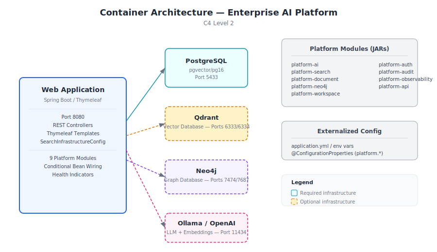
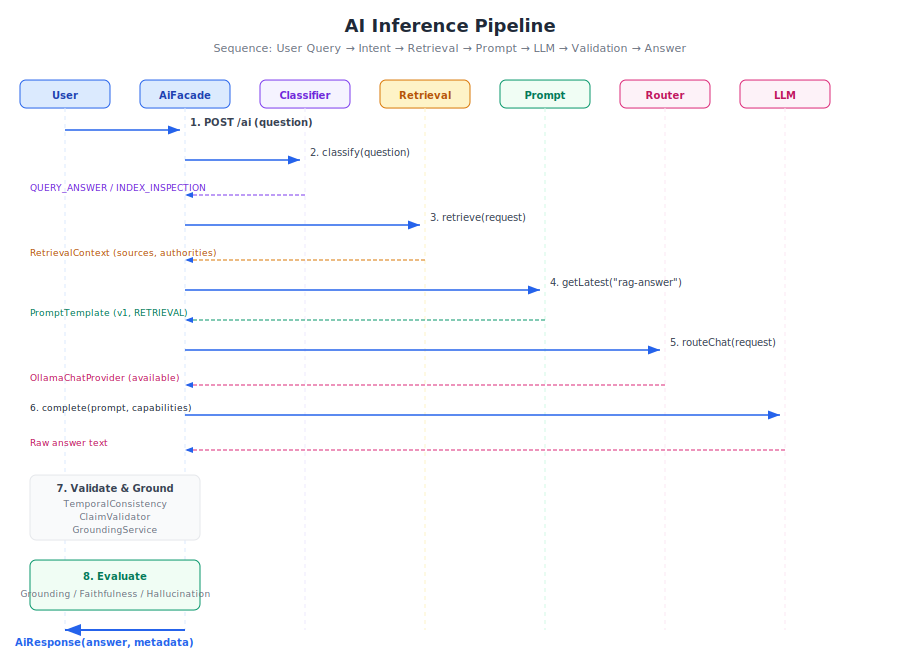
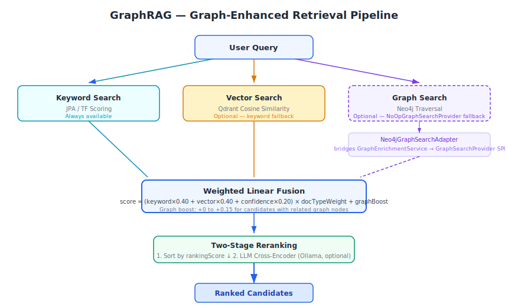

# Enterprise AI Platform — Architecture & Engineering Handbook

**Third Edition — June 2026**

---

> This handbook is for the engineer who looks at an AI demo and immediately asks: *What happens when it fails? How do I extend it? Why was it designed this way?* If you are that engineer, start here. By the end, you should understand not only how this platform works, but how to think about designing one yourself.

---

## Contents

**Part I — Vision**
1. [Enterprise AI Is Different](#1-enterprise-ai-is-different)
2. [The Principles That Shape Every Decision](#2-the-principles)
3. [Why This Platform Exists](#3-why-this-platform-exists)

**Part II — Architecture**
4. [How the Platform Fits Together](#4-how-the-platform-fits-together)
5. [The Document Journey](#5-the-document-journey)
6. [How AI Is Wired In](#6-how-ai-is-wired-in)

**Part III — Subsystems**
7. [Semantic Enrichment](#7-semantic-enrichment)
8. [GraphRAG](#8-graphrag)
9. [The Retrieval Decision Layer](#9-the-retrieval-decision-layer)
10. [Prompts as Engineering Assets](#10-prompts-as-engineering-assets)
11. [Models as Infrastructure](#11-models-as-infrastructure)
12. [Workflows Without Hardcoding](#12-workflows-without-hardcoding)

**Part IV — Operations**
13. [The Audit Trail](#13-the-audit-trail)
14. [Observing What Happens](#14-observing-what-happens)
15. [Security](#15-security)
16. [How We Test This](#16-how-we-test-this)
17. [Deployment](#17-deployment)

**Part V — Reflection**
18. [Extending the Architecture](#18-extending-the-architecture)
19. [Design Rules](#19-design-rules)
20. [Performance Notes](#20-performance-notes)
21. [The Trade-offs We Accepted](#21-the-trade-offs)
22. [What We Learned](#22-what-we-learned)
23. [Evolution of the Platform](#23-evolution-of-the-platform)
24. [Where This Platform Fits](#24-where-this-platform-fits)
25. [The Architecture Endures](#25-the-architecture-endures)

**Appendices:** [A — Key Decisions](#appendix-a) · [B — Glossary](#appendix-b) · [C — References](#appendix-c)

---

## About This Project

Rather than replacing AI orchestration frameworks, this platform provides a reusable architectural foundation for building document-centric AI applications. It complements tools like LangChain and Spring AI — those libraries provide APIs for calling models; this platform demonstrates the infrastructure that makes those calls auditable, replaceable, and resilient.

This project embodies the architectural patterns that separate an AI demo from an AI platform.

A framework makes it easy to call a model. A platform makes it possible to swap models without rewriting code, to trace every answer to its source, to prove to an auditor that the system did not hallucinate, to keep running when infrastructure fails. These are architecture concerns, not library concerns.

When we started building, we made an explicit choice: design for the unhappy path first. What happens when the vector database is down? Which prompt version produced that answer last Tuesday? How do we add a new provider without touching business logic? These questions shaped every decision that follows.

The result is a modular monolith — nine modules in a single deployable, with compile-time boundaries enforcing dependency direction. It runs on Java 21 and Spring Boot 3.3, backed by 157 automated tests and 20 Architecture Decision Records.

The platform focuses on reusable architectural patterns rather than product-specific capabilities such as multi-tenancy, billing, or large-scale SaaS operations. It demonstrates the infrastructure needed to build intelligent document-centric applications, regardless of the user interface placed on top of them. It is a reference implementation — a codebase another engineering team could adopt as the starting point for their own AI application.

---

## Part I — Vision

---

## 1. Enterprise AI Is Different

There are two kinds of AI projects. The first kind — by far the more common — starts with a notebook. Someone loads a dataset, picks a model, writes a prompt, and gets impressive results within hours. The demo works. Everyone is excited.

Then an engineer asks a question the notebook never anticipated.

*Can we trace which document this answer came from?*

*What happens when the vector database is down?*

*How do we switch from Ollama to OpenAI without rewriting the retrieval code?*

*Which version of the prompt produced this answer last Tuesday?*

*Can we prove to an auditor that the system didn't hallucinate this claim?*

These are not unreasonable questions. They are exactly the questions enterprise software must answer. But they are invisible in a notebook. A notebook has one happy path. Enterprise software needs every path — especially the unhappy ones — handled deliberately.

This is the gap between an AI demo and an AI platform.

### The Three Gaps

Three specific gaps separate demos from platforms.

**The observability gap.** A notebook produces output. A platform produces output *and* an audit trail. Which model ran? Which prompt version was used? Which documents were retrieved? How confident is the answer? Without this metadata, AI output is indistinguishable from guesswork.

**The provider coupling gap.** A notebook calls `openai.ChatCompletion.create()`. A platform calls `chatProvider.complete(prompt)`. The difference is indirection — and indirection is what makes provider swaps possible without rewriting business logic.

**The degradation gap.** A notebook crashes when an API is unreachable. A platform degrades gracefully — keyword search continues when vectors are unavailable, enrichment falls back to regex when the LLM is down, retrieval works without the knowledge graph. Every external dependency is optional by design.

| Concern | Demo | Platform |
|---------|------|----------|
| Provider coupling | Hardcoded API calls | Abstract interfaces with conditional activation |
| Failure handling | Exceptions propagate to user | Graceful degradation with fallback implementations |
| Prompt management | Strings in source code | Versioned registry with audit trails |
| Answer quality | Subjective assessment | Automated evaluation: grounding, faithfulness, hallucination |
| Audit trail | None | Full explainability metadata on every inference |
| Extensibility | Rewrite code | Implement SPI + add configuration |

This platform closes those three gaps. It is a working reference implementation — a reusable architectural foundation. When we set out to build it, the goal was to create a foundation where architectural concerns — modularity, degradation, explainability, auditability — are first-class, not retrofitted.

The architecture embodies a simple thesis: **AI is infrastructure, not a feature.** Treat LLMs, embedding models, vector databases, and knowledge graphs the way you treat PostgreSQL. Abstract them behind interfaces. Select them via configuration. Swap them without touching business logic.

That thesis shapes every decision that follows.

> **Design Rule** — Business logic must never depend on a specific AI provider. Every provider integration lives behind an interface. Every interface has a fallback implementation for when the provider is unavailable. No exception.

---

## 2. The Principles

Eight principles keep hundreds of design decisions coherent. When a proposal conflicts with a principle, the proposal is rejected — or the principle is amended explicitly, with documented rationale. There is no silent drift.

### AI Is Infrastructure

LLMs, embedding models, vector databases, knowledge graphs — these are infrastructure components. They belong behind interfaces. Business logic depends on abstractions. Implementations activate based on configuration.

A document enrichment service never calls a specific LLM provider. It calls an interface. Whether that interface is backed by Ollama, OpenAI, or a regex fallback is not a business concern. This pattern repeats everywhere — retrieval, embedding, reranking, evaluation.

### Graceful Degradation, Not Hard Failures

In production, external services fail. We learned this the hard way on previous projects — a vector database going down at 2 AM should not take the entire search system with it. Designing for degradation from day one means every external dependency is optional.

The platform starts with only PostgreSQL. Add Qdrant: vector search activates. Add Neo4j: the graph populates. Remove any: the platform continues, reduced capabilities logged clearly, never silently.

> **Engineering Observation** — Degradation is not a feature you add later. It is a design constraint you build against from the first line of code. Retrofitting degradation into a system that assumes all services are always available is exponentially harder than designing for it upfront.

### Explainability by Default

If this platform generates an answer, it can explain itself — which intent was classified, which strategy was selected, which prompt template and version was used, which provider and model ran inference, how many chunks and graph nodes were retrieved, and what evaluation scores resulted. All generated as a byproduct of execution. No separate "explain this" pass. Zero cost in the happy path.

> **Design Rule** — Explainability must have zero marginal cost. If explaining an answer requires additional computation, it will be disabled under load precisely when it is most needed. Build it into the execution path or don't build it at all.

### Documents Are the Knowledge Source

Users upload documents. The platform builds the knowledge. There is no manual knowledge base. The enrichment engine extracts entities, concepts, and relationships automatically during ingestion. The knowledge graph is auto-generated.

An earlier version of this project included a manual knowledge base where users could create and curate structured knowledge entries. We removed it. The realization was simple: maintaining a parallel knowledge structure alongside the document corpus created consistency problems. Which was authoritative — the uploaded document or the curated entry? What happened when the document was updated but the entry was not? The document corpus is the only source of truth. Everything else is derived.

### Domain Independence

The core contains no assumptions about any industry or document type. Domain customization lives behind a pluggable interface. The included Document Intelligence application provides defaults. New domains add their own configuration — no core changes.

### Testing as Architecture Documentation

Tests describe behavior, not implementation. A Staff Engineer should understand the platform by reading the test suite. Test names read like specifications.

### Production Readiness

Observability, health checks, and configuration are first-class concerns designed alongside the features they observe — not afterthoughts added before release.

### Modular Monolith

Module boundaries enforced at compile time. Dependency flows one way. Higher modules depend on lower modules — never the reverse.

---

## 3. Why This Platform Exists

Most AI projects begin the same way. Someone writes a script that calls an LLM API. They demo it on a laptop with one document. It works. Everyone is excited.

Then the engineering questions begin.

*What happens when the vector database is down? Which prompt version generated that answer? How do we add a new provider alongside the existing one without rewriting the retrieval code? Can we trace why this answer cited that document?*

These questions expose the gap between an AI demo and an AI platform. A demo needs one happy path. A platform needs every unhappy path handled deliberately.

This project closes that gap. It demonstrates how experienced engineers integrate AI into enterprise infrastructure — not as a feature bolted onto an existing system, but as infrastructure designed from first principles.

The result is a modular monolith: nine modules in a single deployable, with compile-time boundaries enforcing dependency direction. This is a foundation — code another engineering team could adopt as the starting point for their own AI application.

What's in scope: multi-provider AI orchestration, hybrid search across keyword, vector, and graph sources, automatic semantic enrichment during ingestion, GraphRAG with knowledge graph traversal, versioned prompt management, a queryable model capability database, automated evaluation of every answer, full explainability metadata, a reusable workflow engine, production metrics, and 157 automated tests.

What's deliberately absent: microservices, multi-agent systems, model fine-tuning, user management, billing. These are valid concerns — they belong to a different architectural layer. This platform provides the AI infrastructure foundation on top of which those product capabilities would be built.

### Why Document Intelligence?

Documents are an ideal domain for demonstrating Enterprise AI architecture. They naturally demand the capabilities that separate a platform from a demo.

**Provenance.** Every answer must trace to a source document. Documents are the evidence — you cannot cite what you cannot find.

**Citations.** Answer quality is measured by how well claims are supported by source material. Documents provide that source material.

**Explainability.** Auditors and regulators ask "why did the system produce this answer?" With documents, the answer is concrete: "Because it retrieved these passages from these sources, using this prompt version and this model."

**Auditability.** Every inference must be reproducible. Document-based retrieval makes this possible — re-run the same query against the same index, and the same documents surface.

**Traceability.** Document ingestion creates a provenance chain — original file → extracted text → chunks → embeddings → graph nodes. Every transformation preserves a link back to the source.

**Semantic retrieval.** Documents contain entities, concepts, and relationships that keyword matching misses. Extracting and indexing this structured understanding transforms search from "does this document contain these words?" to "does this document discuss this topic?"

Documents are not the only domain where these concerns matter — regulatory filings, engineering documentation, contracts, financial reports, medical records, and technical specifications all share the same requirements. The architectural principles demonstrated here apply equally to any domain where answers must be grounded in an authoritative corpus. Documents simply make the clearest case study.

---

## Part II — Architecture

---

## 4. How the Platform Fits Together


**Figure 4.1.** Nine modules in three layers. Dependency flows downward. The application module depends on everything. Nothing depends on the application module.

### The Modular Monolith

Three layers, nine modules, one direction of dependency.

At the bottom sits the audit module — the only leaf. Every other module depends on it for immutable audit logging with correlation IDs that thread through every request.

The middle layer holds seven platform modules. Each has one responsibility. Authentication. Document lifecycle. Hybrid search. AI orchestration. Knowledge graph persistence. Workspace management. Observability. When a module grows large, its internal package structure provides further separation without adding Maven modules. The goal is clarity, not a specific module count.

At the top, the assembly module wires everything together — REST controllers, UI templates, DTOs, and the configuration that conditionally activates provider beans based on which infrastructure is available. Future applications would create their own assembly modules on the same platform foundation.

| Approach | Benefits | Costs |
|----------|----------|-------|
| Modular Monolith | Compile-time boundaries; single deployable; clear dependency direction | No runtime isolation; modules share JVM |
| Microservices | Independent deployment; isolated failure domains; per-service scaling | Network complexity; eventual consistency; operational overhead |
| Single JAR (no modules) | Simplest to build | No dependency enforcement; rapid architectural decay |

> **Architectural Lesson** — Start with a modular monolith. Extract microservices when you have a specific reason — a team boundary, an independent scaling requirement, an isolated failure domain. The modular boundaries you built at compile time become the seams for future extraction. If you start with a single JAR without modules, extraction requires first discovering where the boundaries should have been. The modules are cheap to build now and expensive to retrofit.

### External Dependencies


**Figure 4.2.** Four external systems. PostgreSQL is required. Everything else — Qdrant, Neo4j, LLM providers — is optional.



**Figure 4.3.** A single Spring Boot process communicates with its dependencies over standard protocols. Optional services have dashed borders — the architecture expects them to sometimes be absent.

The platform communicates with four external systems. PostgreSQL is the only hard requirement. Qdrant provides vector search. Neo4j stores the knowledge graph. Ollama or OpenAI provide LLM inference and embeddings. Each additional service adds capability but is never required.

Spring Boot 3.3 with Java 21 was chosen for ecosystem breadth and enterprise familiarity — not because it is the fastest or most lightweight framework, but because a reference implementation should prioritize clarity over novelty.

### Why Java?

A reasonable question: in an era where most AI infrastructure is built in Python, why choose Java?

**Ecosystem maturity.** Spring Boot provides battle-tested infrastructure — security, JPA, scheduling, Actuator, property binding — that would need to be built or assembled from disparate libraries in other ecosystems. This lets the architecture focus on AI concerns rather than application infrastructure.

**Compile-time safety.** Nine Maven modules with directional dependencies enforced at compile time. A Python project with equivalent modularity would require runtime enforcement through import linters and convention. Java's type system and Maven's dependency resolution make module boundaries structural, not aspirational.

**Concurrency model.** Java 21's virtual threads enable straightforward parallel processing of document ingestion, embedding generation, and enrichment — without the complexity of reactive programming models or the overhead of platform thread pools.

**Operational ecosystem.** Micrometer for metrics, Prometheus for collection, Actuator for health checks — the Java observability ecosystem is mature and standardized. These are not libraries you need to evaluate and integrate. They are conventions the ecosystem has already settled.

**Long-term maintainability.** A reference implementation meant to be studied by other engineering teams benefits from explicit types, clear interfaces, and a language where refactoring is supported by tooling rather than test coverage alone.

None of this means Java is universally superior to Python for AI work. It means Java was the right choice *for this project* — a modular monolith prioritizing architectural clarity, long-term maintainability, and enterprise integration patterns over development speed.

---

## 5. The Document Journey

A document's journey through the platform touches text extraction, semantic enrichment, chunking, embedding generation, and three separate persistence stores — all while the user who uploaded it has moved on to other things.

### The Asynchronous Choice

When we first built the ingestion pipeline, we considered processing documents synchronously during the HTTP request. The upload endpoint would extract text, chunk, embed, and index — all before returning a response. This worked on a laptop with a 2-page PDF. It failed completely with a 200-page financial report.

Document processing takes seconds to minutes. HTTP request threads should never block that long. The fix was a scheduled worker that polls for pending jobs every ten seconds. Upload creates a job and returns immediately. The worker does the heavy lifting asynchronously.

> **Engineering Observation** — "It works on my machine" is the most dangerous phrase in software engineering. What works for a 2-page PDF on localhost fails catastrophically for a 200-page PDF behind a load balancer. Design for the worst case, not the demo case.


**Figure 5.1.** The ingestion pipeline. Upload creates a pending job. A scheduled worker polls every 10 seconds. Extraction, enrichment, chunking, and embedding run sequentially. Results land in PostgreSQL, Qdrant, and Neo4j.

The pipeline is sequential by design, not by limitation. Parallel enrichment and embedding would improve throughput but make the code harder to trace. The reference implementation prioritizes clarity. Production deployments may add parallelism — the architecture does not prevent it.

### Enrichment Before Chunking

One design choice emerged during testing: enrichment runs before chunking, not after. Our first implementation chunked first, then enriched each chunk individually. Entity extraction quality was poor — a name like "Apple" is ambiguous in a 200-word chunk but obvious in a 5,000-word financial report. Reversing the order — enrich the full document, then chunk — improved entity disambiguation significantly. This looks obvious in retrospect. It was not obvious when we wrote the first implementation.

> **Lesson Learned** — Context size matters for extraction quality. Chunking destroys context. Run extraction on the largest coherent text unit available, then chunk the results. This principle applies beyond document processing — it applies to any system that extracts structured information from unstructured text.

### Degradation in Practice

The [graceful degradation principle](#2-the-principles) governs every step of the ingestion pipeline. Each stage degrades independently. No embedding provider configured? Chunks are stored keyword-only, and search still works. No LLM available? Regex patterns extract entities with reasonable accuracy. No Neo4j? Enrichment still runs — only graph persistence is skipped. The pipeline is a chain of independent, fallible steps, not a monolithic transaction.

---

## 6. How AI Is Wired In

Answering a question with AI is not one operation. It is twelve — and each produces metadata that feeds the explainability trail.



**Figure 6.1.** The twelve-step inference pipeline. Every step produces metadata. Validation, grounding, and evaluation run even when earlier steps produce warnings — the platform surfaces concerns rather than hiding them.

### The Full Pipeline

**Intent classification.** Before launching expensive retrieval, the system classifies the query. An index inspection routes to keyword-only. A substantive question enters the full RAG pipeline. This classification is deterministic — same query, same path, every time.

**Strategy selection.** The classified intent maps to a retrieval strategy. Keyword for exact lookups. Hybrid for complex questions. Semantic for conceptual exploration. The mapping is a simple lookup table, not a machine learning model — explainable, auditable, and sufficient for current query types.

**Retrieval.** Search fans out to keyword, vector, and optionally graph sources. Results are fused through weighted linear combination and reranked.

**Context assembly and prompt building.** Retrieved chunks and analysis objectives are assembled. The prompt registry resolves the latest template. Variables are substituted.

**Provider selection.** The router selects which LLM backend to use based on model prefix, capability requirements, preference, and availability.

**LLM inference, validation, grounding.** The selected provider generates raw answer text. Temporal consistency is checked. Claims are validated against available sources. Sources are re-attributed with confidence scores.

**Evaluation and explainability.** Every decision from the pipeline is captured — traceable, auditable, deterministic. The `explain()` method produces a human-readable summary.

### The Provider Architecture


**Figure 6.2.** Five service provider interfaces decouple business logic from infrastructure. Implementations activate conditionally. Fallbacks ensure the platform works without any optional service.

| Approach | Example | Consequence |
|----------|---------|-------------|
| Provider SPI | `chatProvider.complete(prompt)` | Swap providers without changing orchestration |
| Direct API calls | `openaiClient.chat(prompt)` | Every provider change requires rewriting business logic |
| Factory pattern | `ProviderFactory.get("openai")` | Centralized but still couples factory to provider names |

The provider architecture is the Strategy pattern applied to AI infrastructure. Business logic depends on interfaces. Implementations activate based on configuration. The two never meet in source code. This is not novel — but applying it consistently to AI, where most projects hardcode provider specifics, is what makes the architecture worth studying.

> **Design Consequence** — Every provider interface must have at least two implementations: the real provider and a fallback that returns a sensible result or a clear degradation signal. If you only have one implementation, you have not proven the interface is actually an abstraction — you have only renamed the dependency. The second implementation validates the interface design.

---

## Part III — Subsystems

---

## 7. Semantic Enrichment

Keyword search finds exact matches. Vector search finds semantically similar passages. Neither understands that "Acme Corporation" is an organization, or that "$45.2 million" relates to "revenue," or that "Dr. Sarah Chen" signed a document on a specific date.

This structured understanding — who, what, when, how much — is what enables intelligent retrieval. Without it, a query like "What contracts did Acme sign in Q2?" relies on the hope that relevant documents contain those exact words near each other.

| Approach | How it works | Limitation |
|----------|-------------|------------|
| Keyword search | Exact token matching | Misses synonyms, entities, relationships |
| Vector search | Semantic embedding similarity | Misses structured relationships (entities, concepts) |
| Semantic enrichment | Extract entities, concepts, relationships | Requires extraction accuracy; builds structured knowledge |


**Figure 7.1.** Enrichment runs after text extraction, before chunking. Full document context improves entity disambiguation. Results flow to the knowledge graph when available.

### Dual-Mode Extraction

The enrichment engine uses two modes, selected automatically: LLM-based extraction when a chat provider is available (higher accuracy, understands context), and regex pattern matching when no LLM is available (catches organizations, persons, dates, monetary amounts — enough for basic retrieval enhancement).

| Mode | When used | Accuracy | Dependency |
|------|-----------|----------|------------|
| LLM-based | Chat provider available | Higher — understands context | Requires LLM |
| Regex | No LLM available | Baseline — patterns only | No dependency |

### Why Enrich During Ingestion

Enrichment is expensive — LLM calls, regex passes over full documents. Query-time latency budgets are measured in milliseconds. Pre-computing enrichment during ingestion means retrieval is fast and enrichment quality is known before any question is asked. This is an architectural trade-off: ingestion latency for query-time speed.

### Provenance

> **Design Rationale:** Every graph node carries provenance. Without it, "Acme Corporation is an ORGANIZATION" could be a hallucination. With provenance, you trace it to the exact document, chunk, model, prompt version, and timestamp. The knowledge graph is auditable — not in theory, in every node, by construction.

---

## 8. GraphRAG

Traditional RAG retrieves chunks by keyword and vector similarity. It works when relevant documents share vocabulary or embedding proximity with the query. It fails when documents are semantically related but textually distant.

Example: a contract signed by Acme Corporation and a financial report mentioning Acme's Q2 revenue share no keywords, and their embeddings may sit far apart in vector space. But they are undeniably related — through the entity "Acme Corporation."

| Approach | Strength | Weakness |
|----------|----------|----------|
| Keyword retrieval | Exact matches; fast | Misses synonyms, conceptual connections |
| Vector retrieval | Semantic similarity | Misses structured entity relationships |
| Graph traversal | Entity/concept connections | Requires populated knowledge graph |

A knowledge graph captures these relationships explicitly. Traversing it reveals connections that keyword and vector search miss. This was the motivation for GraphRAG — not theoretical elegance, but a real retrieval blind spot.

GraphRAG depends on [Semantic Enrichment](#7-semantic-enrichment) — without entity extraction during ingestion, there are no nodes to traverse. The enrichment pipeline populates the graph; GraphRAG queries it. The two subsystems were designed together because neither delivers its full value alone.



**Figure 8.1.** Three retrieval sources converge in weighted fusion. Graph results boost existing candidates — they don't compete with them. When the graph is unavailable, retrieval degrades to keyword + vector.

### The Central Design Choice

Graph results **boost, not replace.** A graph traversal finding that adds up to 15% score increase for candidates with related graph nodes. A document at position #15 by keyword + vector might move to #5 because it mentions the same entities as a top-ranked document. Graph context nudges rankings rather than overriding them.

### A Cautionary Tale

An honest admission: GraphRAG was documented as a feature for months before it was implemented. The architecture manual described knowledge graph participation in retrieval. The code used a permanent no-op fallback. Building the adapter that bridged enrichment output to the retrieval SPI closed that gap. The lesson: document what *is* built, not what *should be* built. Documentation ahead of implementation creates confusion. Documentation trailing implementation is always accurate.

---

## 9. The Retrieval Decision Layer

Running every retriever for every query wastes resources. An index inspection does not need vector search. A conceptual question benefits from semantic similarity. A complex analytical question benefits from hybrid search with graph augmentation.

The solution: a decision layer whose sole responsibility is choosing which retrievers to use based on classified intent.


**Figure 9.1.** Intent drives strategy deterministically. Every routing decision is logged for auditability.

| Query Type | Strategy | Why |
|------------|----------|-----|
| Index inspection, corpus discovery | Keyword only | Exact match queries; vector search adds no value |
| Question answering, analysis | Hybrid | Complex queries benefit from keyword + vector fusion |
| Document research, lookup | Semantic | Conceptual queries match better on meaning than keywords |

### Deterministic Over ML-Based

The intent classifier uses keyword rules, not machine learning. We made this choice deliberately. Deterministic routing means the same query always takes the same path — debuggable, auditable, predictable. A trained classifier would likely be more accurate, but we valued transparency over accuracy for this component.

The consequence is worth stating plainly: misclassification propagates deterministically. A query classified as keyword-only when it needs hybrid search will produce poorer results every single time.

> **Trade-off** — Deterministic classification was chosen over ML-based classification. This sacrifices accuracy for transparency and debuggability. An ML classifier might misclassify fewer queries, but when it does misclassify, the reason is opaque. A keyword-rule classifier misclassifies more often, but every misclassification can be inspected, understood, and fixed. For a reference implementation, transparency wins over accuracy. In production, the trade-off may reverse — and the interface supports replacing the classifier without touching the orchestrator.

> **Design Rule** — Make components individually replaceable. The classifier can be upgraded from keyword rules to an ML model without any changes to the retrieval orchestrator, the prompt builder, or the inference pipeline. Each component owns its interface. No component owns another component's implementation.

### The Fusion Algorithm

Weighted linear combination — not Reciprocal Rank Fusion. RRF requires rank positions from every retriever, which are not always available (graph search returns discovery results, not ranked lists). Weighted linear fusion works with raw scores and is simpler to explain. The algorithm is accurately named — we don't claim to implement RRF.

```
score = (keyword×0.40 + vector×0.40 + confidence×0.20) × docTypeWeight + graphBoost
```

---

## 10. Prompts as Engineering Assets

A prompt is the interface between your application and an LLM. Change the prompt, and answers change — sometimes subtly, sometimes dramatically. In most AI projects, prompts are strings embedded in source code. Changed without versioning. Untraceable after deployment. Impossible to A/B test.

This works for prototypes. It fails for platforms where the prompt *is* the product.

> **Engineering Observation** — Prompt versioning appears unnecessary until the first prompt regression. A small wording change degrades answer quality, nobody can trace which answers used the old version, and rollback means reverting a git commit and redeploying. After that experience, versioning becomes mandatory.

Consider what happens without a registry. A team member changes a prompt to fix a specific issue. The change ships. A week later, someone notices that answers to a different class of questions have degraded. Which prompt version produced those degraded answers? Nobody knows. The prompts were strings in code — they changed, and the only record is a git diff buried in a commit with an unhelpful message.

A versioned registry makes this problem disappear. Every prompt has a qualified ID — `rag-answer/v1`, `entity-extraction/v1`. Every inference records which prompt version was used. When answer quality changes, you can correlate it to a prompt change immediately. You can run the same query against v1 and v2 and compare evaluation scores. Prompt changes become auditable, testable, and reversible.

Nine categories organize prompts by purpose — retrieval, summarization, extraction, classification, evaluation, reasoning, workflow, graph, search, system. Categories enable discovery: querying the registry by category returns all prompts designed for a given task. A new team member can browse the registry and understand what prompts exist and how they are used.

The registry is deliberately simple. No template inheritance — prompts are independent. No dependency between prompts — changing one never affects another. No runtime compilation — substitution is simple string replacement. Complexity should be justified by need, not added preemptively.

The [Retrieval Decision Layer](#9-the-retrieval-decision-layer) resolves which prompt template to use based on classified query intent. The [Audit Trail](#13-the-audit-trail) records which prompt version produced every inference. Together, these three subsystems — registry, orchestrator, audit — form a closed loop: prompts are authored, versioned, selected, executed, and traced.

> **Design Rule** — Every prompt must be versioned. Every inference must record which prompt version was used. This is not optional. It is the minimum requirement for auditing, debugging, and improving prompt quality over time.

---

## 11. Models as Infrastructure

Different models have different capabilities. GPT-4o supports vision and structured output. nomic-embed-text only does embeddings. qwen2.5:7b is fast and local but lacks vision. Business logic must not hardcode assumptions about model capabilities.

The model capability registry describes every known model across eight capability dimensions plus quantitative metadata: context window, output tokens, latency estimates, cost estimates, temperature, use cases.

| Selection Strategy | How it works | When it applies |
|--------------------|-------------|-----------------|
| Model prefix | `openai:gpt-4o` routes to openai provider | Explicit model choice |
| Capability match | Request STREAMING → find capable provider | Capability requirement |
| Preferred provider | Caller preference | Known provider preference |
| First available | First healthy provider | Fallback |

The router receives all available implementations via dependency injection. Adding a provider means implementing the interface and adding a Spring component — the router discovers it without code changes. This is the Strategy pattern applied to AI infrastructure.

The architecture prevents business logic from selecting providers directly. Services request capabilities — streaming, embeddings, JSON output — and the router maps capabilities to providers. This indirection is what makes adding providers a zero-change operation for orchestration code.

The router and model capability registry are separate concerns — the registry describes what exists, the router decides what to use. This separation means the registry can be updated without touching routing logic. Every routing decision is recorded by the [Audit Trail](#13-the-audit-trail), linking each inference to the specific provider and model that produced it.

---

## 12. Workflows Without Hardcoding

Document intelligence involves multi-step processes. Upload leads to extraction, enrichment, chunking, indexing, review, completion. Hardcoding these steps in a controller couples process logic to HTTP concerns and prevents reuse.

| Approach | Flexibility | Complexity | When to use |
|----------|-------------|------------|-------------|
| Controller logic | Low — hardcoded | Low | Single fixed workflow |
| Workflow engine | High — configurable | Medium | Multiple workflows, reusable |
| BPMN engine | Very high | High | Complex branching, enterprise BPM |

The workflow engine separates process definition from execution. Five methods cover the API. Two workflows come pre-registered. Steps declare handler types as extension points.

The engine deliberately avoids BPMN frameworks or state machine libraries. Five methods on an interface. Deterministic linear transitions. Not the most powerful workflow engine — the simplest one that demonstrates the concept.

> **Operational Note** — The workflow engine interface was designed so that adopting Camunda, Temporal, or a state machine library would not require changing callers. When the simple engine is no longer sufficient — when workflows need parallel branches, human approval steps, or long-running sagas — the substitution is local to the engine implementation. The five-method interface was chosen not because it is the best workflow API, but because it is the narrowest contract that can be satisfied by both a simple in-memory implementation and a full BPMN engine.

---

## Part IV — Operations

---

## 13. The Audit Trail

If this platform generates an answer, it can explain itself. Not because someone added a feature — because the orchestration layer records every decision as it happens. Intent classification. Strategy selection. Prompt template and version. Provider and model. Result counts from every retriever. Fusion method. Reranking status. Evaluation scores.

The metadata is generated during normal execution. There is no separate "explain this" pass, no post-hoc analysis, no second LLM call. Every code path produces metadata by construction.

The design principle: explainability must have zero marginal cost. If explaining an answer requires additional computation, it will be disabled under load. By making explanation a byproduct of execution, it stays on by default, in every environment, forever.

---

## 14. Observing What Happens

A platform running AI workloads needs metrics designed for AI workloads — not just request counts and error rates, but inference latencies broken down by provider and model, embedding batch durations, retrieval timings by strategy, enrichment entity counts, evaluation score distributions.

The observability module provides Micrometer metrics for every AI operation. Timers with percentile histograms. Gauges for provider availability. Summaries for evaluation scores. All exported to Prometheus and surfaced through health checks.

The metric definitions stabilize first. Full integration follows. This ordering is deliberate: define the interface, validate with a few integrations, then roll out broadly. Wiring everything at once produces metrics nobody asked for.

---

## 15. Security

The security model is standard by design. JWT with BCrypt-12 hashing. Refresh tokens hashed before storage, rotated on use. Both stateless API authentication and session-based form login. Provider API keys injected via environment variables — never committed. Input enters through variable placeholders in vetted prompt templates. Responses are HTML-escaped.

> **Design Rule** — Innovation in security is a bug, not a feature. Use proven patterns. Do not invent authentication schemes. Do not roll your own cryptography. The platform's security is deliberately unremarkable because remarkable security is usually broken security.

---

## 16. How We Test This


**Figure 16.1.** Five testing layers. Default build runs everything except browser tests, which use a separate profile to keep the primary build fast.

| Layer | Count | Validates |
|-------|-------|-----------|
| Unit | 44 | Individual components — registries, router, evaluation |
| Integration | 91 | Subsystem interaction with real Spring context |
| Architecture | 10 | End-to-end behavior — enrichment, retrieval, evaluation |
| Resilience | 9 | Graceful degradation — fallback, unavailable services |
| Contract | 5 | SPI stability — every provider satisfies abstract contract |
| Browser | 12 | User journeys via Playwright (separate profile) |

The test suite is structured as executable architecture documentation. Tests describe behavior: "routes openai:gpt-4o to openai provider" — not "testProviderRouter." A Staff Engineer should understand the platform by reading the tests.

---

## 17. Deployment

One command starts the platform. One configuration file controls it. Every custom property lives under the `platform.*` namespace. Every external service is optional — the platform starts with PostgreSQL alone.


**Figure 17.1.** The knowledge graph database lives in a separate Docker profile. Every additional service adds capability but is never required. A reference implementation should be trivial to run on a development machine.

---

## Part V — Reflection

The preceding chapters described how the platform works. The remaining chapters step back and ask: what did we learn? What rules emerged? What trade-offs proved correct? What would we do differently?

These questions separate documentation from architecture. Documentation describes what was built. Architecture explains why it was built that way — and what the builder learned in the process.

---

## 18. Extending the Architecture

The architecture was designed for extension. Four patterns cover the most common needs.

**Adding a provider.** Implement the chat provider interface. Add component annotation with conditional property activation. Register model capabilities. The router discovers it automatically.

**Adding a domain.** Implement the domain configuration interface. Provide it as a Spring bean. Concepts, objectives, hierarchies, and instructions become available without core changes.

**Adding a workflow.** Define steps and transitions. Call the workflow engine's start method. The engine handles state.

**Adding a prompt.** Register a template. It is immediately versioned, categorized, and discoverable.

The goal was never to predict every extension point. It was to establish patterns — interface, conditional activation, registry, dependency injection — that make extension feel natural rather than like working around constraints.

---

## 19. Design Rules

After building this platform, certain rules emerged that now guide every change. They are not theoretical. Each one was learned the hard way — by breaking it, experiencing the consequences, and fixing the result.

**Business logic never depends on providers.** Every AI capability — chat completion, embedding, reranking, enrichment — lives behind an interface. Orchestration code calls the interface. Implementations activate based on configuration. This is the single most important rule. It is what makes provider swaps possible without touching business logic.

**Documents are the single source of truth.** Knowledge is extracted from documents during ingestion. There is no manual knowledge base. If a fact appears in the knowledge graph, it came from a document. If it did not come from a document, it is not in the graph. This rule eliminated an entire class of consistency problems.

**Every prompt is versioned.** Prompts change. When a prompt changes, answers change. Without versioning, you cannot compare answers before and after a prompt change. Without versioning, you cannot audit which prompt produced which answer. The prompt registry makes versioning automatic.

**Every answer is explainable.** The orchestration layer records every decision — intent, strategy, prompt, provider, model, results, scores — as a byproduct of execution. There is no separate explanation step. Explanation has zero marginal cost.

**Every optional dependency degrades gracefully.** The platform starts with PostgreSQL alone. Add Qdrant: vector search activates. Add Neo4j: the graph populates. Remove any: the platform continues. Conditional bean activation, fallback implementations, and availability checks implement this rule everywhere.

**Every extension begins with an interface.** If a component might need to be replaced — and in AI, everything might need to be replaced — define an interface first. Implementations come second. This is not premature abstraction. It is acknowledging that AI infrastructure evolves faster than application code.

**Infrastructure is replaceable.** Qdrant today might be Weaviate tomorrow. Ollama today might be vLLM tomorrow. The architecture assumes this and designs for it. Business logic never imports a specific vector database client.

**Retrieval should be deterministic before it becomes intelligent.** Intent classification uses keyword rules, not ML. Strategy selection is a lookup table. Fusion is weighted linear combination. Every step is deterministic, auditable, and debuggable. Intelligence can be added later — but a system that is not deterministic cannot be debugged, and a system that cannot be debugged cannot be trusted.

**Wiring must be verified, not assumed.** In a Spring application with conditional beans and optional dependencies, it is possible for an entire pipeline to compile, pass tests, and never execute. Wiring verification tests — tests that confirm beans are injected and called — prevent this. This rule was added after we discovered the AI inference pipeline was dead code.

These rules are not permanent. They will evolve as the platform evolves. But they represent hard-won engineering judgment. Breaking any of them should require explicit justification.

---

## 20. Performance Notes

This is a reference implementation, not a production deployment. It has not been benchmarked. What follows are architectural observations.

Chunking scales linearly with document length. Embedding generation is sequential — parallelizable via virtual threads. Weighted fusion is linear in candidate count. Graph traversal is bounded at 2 hops. LLM inference timeout is configurable.

No caching layer exists. Each retrieval re-executes. This is appropriate for demonstrating architecture. It would be the first optimization in production.

---

## 21. The Trade-offs We Accepted

These decisions reflect engineering judgment, not universal truth. Each was debated, documented, and deliberately accepted.

| Decision | Chosen | Alternative | Why |
|----------|--------|-------------|-----|
| Architecture | Modular monolith | Microservices | Compile-time boundaries sufficient; extraction possible |
| Framework | Spring Boot 3.3 | Quarkus | Ecosystem breadth; enterprise familiarity |
| Graph database | Neo4j property graph | RDF / relational | Traversal queries; schema flexibility |
| Fusion algorithm | Weighted linear | Reciprocal Rank Fusion | Heterogeneous scores; simpler explanation |
| Prompt management | Versioned registry | Inline strings | Audit trails; regression testing |
| Enrichment | Dual-mode (LLM + regex) | LLM only | Works without AI infrastructure |
| Provider routing | Deterministic 4-tier | ML-based | Explainable; auditable |
| UI testing | Playwright | Selenium | Modern API; auto-waits; reliability |

Each decision has a dedicated ADR in the companion volume with deeper rationale, alternatives considered, and future evolution paths.

---

## 22. What We Learned

**Clean interfaces make domain-specific code easy to remove.** The original codebase contained 55 German BGB paragraph references and 25+ legal keywords embedded in enrichment and analysis services. They were removed without architectural changes because the interfaces had clean separation from domain logic. The lesson generalizes: invest in interface design early. It pays off when requirements shift. This is not theoretical — it happened, and the interfaces saved months of refactoring.

**Unused dependencies accumulate invisibly.** Five JARs from a Spring AI integration sat on the classpath for months with zero imports anywhere in the codebase. A monthly dependency analysis run would catch this — it costs nothing and prevents deadweight from accumulating. The build audit that discovered this also found Flyway dependencies (migrations written but never enabled) and transitive JARs pulled in by unused direct dependencies.

**Bean wiring must be verified, not assumed.** The entire AI inference pipeline — twelve steps, a dozen collaborating services — compiled cleanly and passed every test. But the pipeline was never connected to the controller. The AI page showed retrieval results without generating LLM answers. A simple wiring verification test caught this. In Spring applications, test that your beans are actually injected and called — not just that they compile.

**Documentation must trail implementation, not lead it.** GraphRAG appeared in the architecture manual months before the code implemented it. The knowledge graph was populated but never queried during retrieval. A permanent no-op fallback sat where real graph traversal should have been. Building the adapter closed that gap. Now documentation reflects code, not aspiration.

**Prompt versioning is table stakes for any AI platform.** What started as a simple registry — store templates, substitute variables — became the foundation for deterministic behavior validation, A/B testing prompts, audit trails, and regression testing. Every inference records exactly which prompt version produced it. This was not planned from the start. It became obvious the first time a prompt change caused a behavior regression and nobody could trace which answers used the old version.

**Tests as documentation works.** Evolving from wiring-verification tests to behavior-driven tests made the suite readable by architects who never touched the implementation. "Routes openai:gpt-4o to openai provider" communicates more than "testProviderRouter" — not because the test implementation differs, but because the name describes what the system does rather than what class it tests.

---

## 23. Evolution of the Platform

Architecture is not designed in a single sitting. It emerges from solving concrete problems, one after another, each solution revealing the next problem that was invisible before. The architecture documented in this handbook did not arrive fully formed. It evolved.

Understanding that evolution matters. It explains not just what the architecture looks like, but why it looks that way — and why certain decisions were made in a particular order.

### The Evolution Path

**Stage 1 — Document upload.** The platform began with a simple capability: accept a file, extract its text, store both. No AI. No search. Just ingestion. This stage proved that asynchronous processing was necessary — large documents blocked HTTP threads, forcing the move to a job queue with scheduled workers.

**Stage 2 — Keyword search.** Once documents were stored, users needed to find them. Full-text search over extracted text was the first retrieval capability. It found exact matches but missed semantically related content — a search for "revenue growth" returned nothing from a document discussing "sales increased."

**Stage 3 — Vector search.** Embedding models transformed text into vectors, enabling semantic similarity search. "Revenue growth" now matched "sales increased." But vector search had its own blind spots — it missed exact identifiers like contract numbers, invoice IDs, and dates that keyword search handled effortlessly.

**Stage 4 — Hybrid retrieval.** Neither keyword nor vector search was sufficient alone. The fusion layer combined both — keyword for precision on exact identifiers, vector for semantic coverage. Each contributed weighted scores. Results improved measurably.

**Stage 5 — Semantic enrichment.** Retrieval quality hit a ceiling. Documents discussing the same entity — "Acme Corporation" — were not connected unless they shared keywords or embedding proximity. The enrichment engine was added: extract entities, concepts, and relationships during ingestion. Now the platform understood not just what words appeared, but what they meant.

**Stage 6 — Knowledge graph.** Extracted entities and relationships needed a home. The knowledge graph captured "Acme Corporation is an ORGANIZATION" and "document X mentions Acme" as explicit, queryable facts. The graph made relationships that were previously implicit in text explicit in structure.

**Stage 7 — GraphRAG.** The knowledge graph existed but was not used during retrieval. GraphRAG connected enrichment output to the retrieval pipeline: graph traversal results boost the scores of candidates that share entities with top-ranked documents. Retrieval now considered three dimensions — keywords, semantics, and relationships.

**Stage 8 — Prompt Registry.** As prompts multiplied — retrieval prompts, extraction prompts, classification prompts, evaluation prompts — they became scattered across source files. A wording change to one prompt caused a regression nobody could trace. The prompt registry made prompts versioned, categorized, and auditable assets.

**Stage 9 — Provider abstraction.** The platform originally called a single LLM provider directly. Adding a second provider required rewriting orchestration code. The provider SPI — chat, embedding, reranking — decoupled business logic from infrastructure. Adding a provider became a configuration change.

**Stage 10 — Retrieval orchestration.** Multiple retrievers created a new problem: which ones to use for which query? Running all retrievers for every query wasted resources. The decision layer — intent classification → strategy selection → retrieval execution — made routing deterministic and auditable.

**Stage 11 — Evaluation.** As the pipeline grew more sophisticated, answer quality became harder to assess subjectively. Automated evaluation — grounding, faithfulness, hallucination detection — provided quantitative quality signals for every answer. Evaluation closed the loop: you could now measure whether an architectural change improved or degraded results.

**Stage 12 — Enterprise AI Platform.** Each preceding stage solved a specific problem. Together they form a coherent architecture — not because someone designed it top-down, but because each solution created the conditions for the next problem to become visible. The platform is the accumulation of twelve engineering responses to twelve concrete needs.

### Architecture Maturity Model

The evolution path suggests a general model. Enterprise AI is not one technology — it is the accumulation of architectural capabilities, each building on the ones below.

```
Level 0 — Call LLM API
    Direct API calls. No abstraction. No retrieval. No audit trail.

Level 1 — Prompt Templates
    Prompts are reusable templates, not inline strings. Basic parameter substitution.

Level 2 — Retrieval-Augmented Generation
    Documents are retrieved and included in the prompt context. Single retrieval method.

Level 3 — Hybrid Search
    Multiple retrieval methods combined through fusion. Keyword + vector.

Level 4 — Semantic Enrichment
    Entities, concepts, and relationships extracted from documents during ingestion.
    Structured understanding supplements unstructured text.

Level 5 — Knowledge Graph
    Extracted knowledge stored as queryable graph. Relationships become explicit.

Level 6 — GraphRAG
    Knowledge graph participates in retrieval. Graph traversal boosts relevant results.

Level 7 — Provider Independence
    All AI infrastructure behind interfaces. Providers selected via configuration.
    Adding a provider requires zero orchestration code changes.

Level 8 — Explainability
    Every inference produces complete metadata. Answers are auditable by construction.
    Zero marginal cost — explanation is a byproduct, not a feature.

Level 9 — Enterprise AI Platform
    All capabilities integrated. Graceful degradation at every level.
    Architecture is the product. Specific technologies are replaceable.
```

Most AI projects stop at Level 2. They add retrieval to LLM calls and consider the problem solved. The remaining levels — enrichment, graph, independence, explainability — are what separate a project that calls an AI API from a platform that integrates AI as infrastructure.

The maturity model is not a roadmap. Not every project needs Level 9. But understanding where you are on the model — and what capabilities become available at the next level — makes architectural planning concrete rather than aspirational.

> **Engineering Observation** — The order matters. Provider independence (Level 7) before explainability (Level 8) means explainability metadata is provider-agnostic from the start. Enrichment (Level 4) before GraphRAG (Level 6) means the graph is populated before it is queried. The levels are not independent — each enables the ones above it. Building them out of order creates rework.

---

## 24. Where This Platform Fits

A platform designed around document intelligence, explainability, and provider independence fits certain scenarios naturally. Other scenarios demand capabilities this platform intentionally leaves to other architectural layers.

### Suitable Domains

This platform's architecture applies wherever answers must be grounded in an authoritative document corpus:

**Enterprise document intelligence.** Organizations with large document collections — contracts, reports, specifications, policies — benefit from retrieval that understands entities and relationships, not just keywords.

**Compliance and regulatory review.** When answers must cite sources and every inference must be auditable, the explainability architecture provides the metadata compliance workflows require.

**Technical documentation.** Engineering organizations with thousands of design documents, incident reports, and runbooks need search that understands technical concepts across document boundaries.

**Legal document analysis.** The provenance, citation, and auditability architecture was designed for domains where the source of every claim matters.

**Financial document processing.** Reports, filings, and analyses share entities — companies, amounts, dates — that enrichment and graph traversal surface across document boundaries.

**Corporate knowledge bases.** Internal wikis, policy documents, and decision records form a document corpus that benefits from semantic retrieval and entity-aware search.

**Internal AI assistants.** Assistants grounded in an organization's own documents require exactly the retrieval, provenance, and explainability architecture this platform provides.

**Retrieval systems for structured knowledge domains.** Any domain where the corpus is documents, the answers must cite sources, and the inference process must be auditable.

These are examples, not limitations. The platform is domain-agnostic by design. The document intelligence application included in the repository demonstrates one domain; new domains are added through configuration, not core changes.

### Beyond Scope

Every architecture defines boundaries. The capabilities below are valid engineering concerns that belong to a different architectural layer — above or alongside the AI infrastructure this platform provides.

**Consumer chatbots.** Conversational AI with personality, multi-turn dialogue management, and session state lives in the application layer. The platform provides retrieval and inference; the application provides the conversation.

**Autonomous agents.** Multi-step agentic workflows with tool selection, planning, and self-correction loops require an agent framework on top of the retrieval and inference infrastructure.

**Model training and fine-tuning.** This platform consumes models; it does not train them. Model training pipelines, dataset preparation, and fine-tuning workflows are separate infrastructure concerns.

**SaaS operations.** Multi-tenancy, subscription billing, user management, rate limiting, and SLA enforcement are product-layer concerns that would be built on top of the platform.

**CRM and business workflow.** Customer relationship management, case tracking, and business process automation belong to application modules, not the AI infrastructure core.

None of these represent gaps. They represent deliberate scope boundaries. The platform provides the AI infrastructure foundation. The application layer provides the product capabilities built on top of that foundation. The separation is architectural, not accidental.

> **Design Consequence** — Every capability the platform deliberately excludes is a capability another team could add without modifying the core. The platform is designed to be built upon, not to be complete. Completeness would mean the architecture cannot accommodate unanticipated requirements. Incompleteness is a feature.

## 25. The Architecture Endures

In five years, the models running this platform will be different. In three years, the vector database may have been replaced. In two years, the LLM provider you use today may no longer exist. The specific choices documented in this handbook — Ollama for local inference, Qdrant for vector storage, Neo4j for graph traversal — will look dated sooner than any of us expect.

But the principles that shaped those choices will not date.

Treating AI as infrastructure rather than a feature means the interface between business logic and AI backends remains stable even as every backend changes. Designing for graceful degradation means the platform is never more fragile than its most unreliable dependency. Making explainability a byproduct of execution means every answer is auditable forever, at zero additional cost. Extracting knowledge from documents during ingestion means enrichment quality is verified before any question is asked.

These principles are independent of any specific technology. They apply whether inference runs on Ollama, OpenAI, or a model that has not been invented yet. They apply whether vectors live in Qdrant, pgvector, or a database that launches next year. They apply whether the graph lives in Neo4j, a property graph embedded in the application, or a graph database built on an entirely different paradigm.

Good software architecture does not predict the future. It makes the present coherent and the future possible. It does not bet on which technology will win. It designs interfaces that make technology choices replaceable. It does not assume services will always be available. It designs for their absence. It does not hide decisions behind opaque implementations. It surfaces them as metadata.

The architecture documented in this handbook is a snapshot — engineering judgment applied to a specific set of technologies at a specific point in time. The implementations will be replaced. The principles — abstraction, degradation, explainability, provenance, domain independence — will outlast every one of them.

Specific technologies are temporary. Engineering principles are durable. The vector database you choose today will be replaced. The model you depend on today may not exist in five years. The framework version you deploy today will be end-of-life long before the architecture it runs becomes obsolete. What endures is the engineering judgment embedded in the interfaces, the degradation boundaries, the audit trails, the abstraction layers — the decisions that make technology replaceable.

A codebase is read by machines. An architecture is read by engineers. The machines will move on to newer code. The engineers will carry the principles forward — to their next project, their next platform, their next architecture.

That is what makes this worth studying. Not because it uses a particular vector database or language model. Because it demonstrates how to think about building one yourself.

> If you have read this far, you understand not only how this platform works but why it was built that way. The principles are yours to apply. The interfaces are yours to adapt. The design rules are yours to follow, break deliberately, or improve. Good architecture is never finished — but this is a good place to start.

---

## Appendix A — Key Decisions

Twenty Architecture Decision Records document every major engineering decision. The complete volume — with introduction, decision index, architecture timeline, and cross-references — is available as [Enterprise-AI-Platform-Architecture-Decision-Records.pdf](Enterprise-AI-Platform-Architecture-Decision-Records.pdf).

| ADR | Title | Status | Category |
|-----|-------|--------|----------|
| 001 | Modular Monolith | Accepted | Architecture |
| 002 | Spring Boot 3.3 | Accepted | Technology |
| 003 | Provider Abstraction via SPI | Accepted | AI Infrastructure |
| 004 | Provider Router | Accepted | AI Infrastructure |
| 005 | Prompt Registry | Accepted | AI Infrastructure |
| 006 | Model Capability Registry | Accepted | AI Infrastructure |
| 007 | Semantic Enrichment Engine | Accepted | Knowledge |
| 008 | GraphRAG | Accepted | Knowledge |
| 009 | Neo4j as Knowledge Graph Persistence | Accepted | Knowledge |
| 010 | Qdrant as Vector Database | Accepted | Knowledge |
| 011 | Retrieval Orchestration | Accepted | Knowledge |
| 012 | Explainability by Default | Accepted | Quality |
| 013 | Evaluation Engine | Accepted | Quality |
| 014 | Workflow Engine | Accepted | Extensibility |
| 015 | AI Observability | Accepted | Operations |
| 016 | Graceful Degradation | Accepted | Operations |
| 017 | DomainConfiguration | Accepted | Extensibility |
| 018 | Provenance-Aware Knowledge Graph | Accepted | Knowledge |
| 019 | Multi-Layer Testing Strategy | Accepted | Quality |
| 020 | Design Philosophy | Accepted | Governance |

---

## Appendix B — Glossary

**Capability** — A feature an AI model supports: streaming, vision, JSON mode, embeddings, tool calling.

**Chat Provider** — The SPI for LLM backends. Every provider implements this interface.

**Chunk** — A segment of document text (~1200 characters) with sentence-boundary awareness and overlap, indexed for retrieval.

**Citation Coverage** — Fraction of AI answer claims that cite a retrieved source.

**Context Window** — Maximum tokens a model can process in a single request.

**Domain Configuration** — Pluggable interface for domain-specific rules: concepts, objectives, hierarchies, instructions.

**Embedding** — A 768-dimensional vector representation of text, generated by an embedding model.

**Enrichment** — Automatic extraction of entities, concepts, and relationships from documents during ingestion.

**Evaluation** — Automated quality assessment: grounding, faithfulness, hallucination indicators, relevance.

**Explainability** — Metadata describing how an inference was produced, generated as a byproduct of execution.

**Faithfulness** — How factually accurate an answer is relative to its source documents.

**Fusion** — Combining retrieval results from multiple sources into a single ranked list.

**GraphRAG** — RAG enhanced with knowledge graph traversal. Graph results boost, not replace.

**Grounding** — The degree to which an answer is supported by retrieved evidence.

**Hallucination** — AI-generated text not supported by source documents.

**Hybrid Search** — Retrieval combining keyword, vector, and optionally graph search.

**Inference** — The process of an LLM generating text from a prompt.

**Intent** — The classified purpose of a query: question answering, document lookup, index inspection.

**Knowledge Graph** — A network of entities, concepts, and relationships extracted from documents.

**Model Capability Registry** — Searchable database of model features, limits, and performance estimates.

**Modular Monolith** — Single deployable with compile-time module boundaries.

**Provenance** — Metadata linking data to its origin: source document, extraction method, model, prompt version, timestamp.

**Prompt Registry** — Versioned store of prompt templates organized by category.

**Provider** — An AI backend implementing a platform SPI.

**Provider Router** — Component that selects which provider to use. 4-tier deterministic selection.

**RAG** — Retrieval-Augmented Generation. Grounding LLM responses in retrieved documents.

**Registry** — A queryable, versioned store of known entities (prompts, models, capabilities).

**Reranking** — Reordering candidates: score sort followed by LLM cross-encoder if available.

**Retrieval Strategy** — Which retrievers to use, selected based on classified query intent.

**SPI** — Service Provider Interface. A pluggable contract for extending the platform.

**Structured Output** — LLM responses constrained to a format like JSON.

**Token** — A unit of text processed by an LLM (~0.75 words in English).

**Vector** — A numerical representation of text meaning, 768 dimensions in this platform.

**Vector Database** — Database optimized for high-dimensional similarity queries.

**Workflow** — A configurable multi-step process with defined state transitions.

**Workflow Engine** — Reusable component for executing workflows.

---

## Appendix C — References

### Architecture & Engineering
- **Spring Boot 3.3 Reference** — The platform's runtime framework
- **Martin Kleppmann, *Designing Data-Intensive Applications*** — Foundational thinking on data systems
- **Martin Fowler, *Patterns of Enterprise Application Architecture*** — Patterns for modular design
- **Simon Brown, C4 Model** — Architecture visualization approach

### AI & Retrieval
- **Lewis et al. (2020), *RAG for Knowledge-Intensive NLP Tasks*** — Foundational RAG paper
- **Microsoft Research (2024), *GraphRAG: From Local to Global*** — Graph-enhanced retrieval
- **Neo4j Graph Data Science** — Graph algorithms for centrality and community detection
- **Qdrant Documentation** — Vector search with payload filtering

### Operations
- **Micrometer** — JVM metrics instrumentation
- **Prometheus** — Metrics collection and alerting
- **Playwright** — Cross-browser automation

### Companion Volumes
- [Architecture Decision Records](Enterprise-AI-Platform-Architecture-Decision-Records.pdf) — 20 ADRs
- [Developer Guide](Enterprise-AI-Platform-Developer-Guide.pdf) — Build, run, extend, test, contribute
