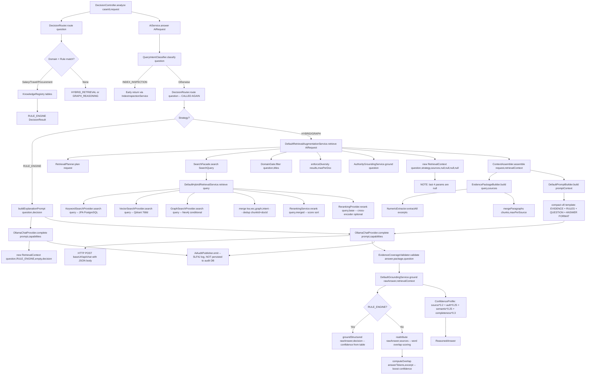
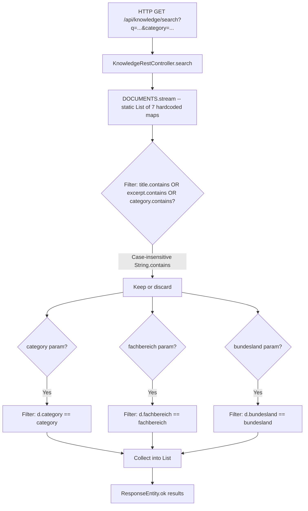
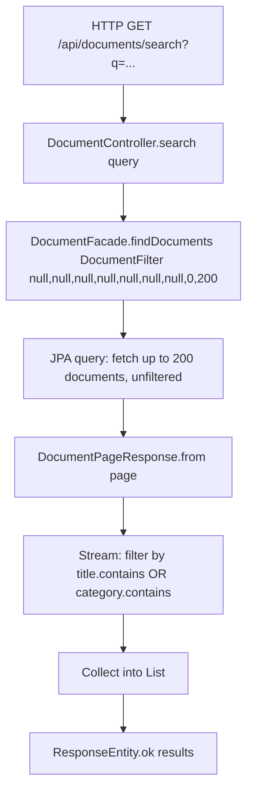
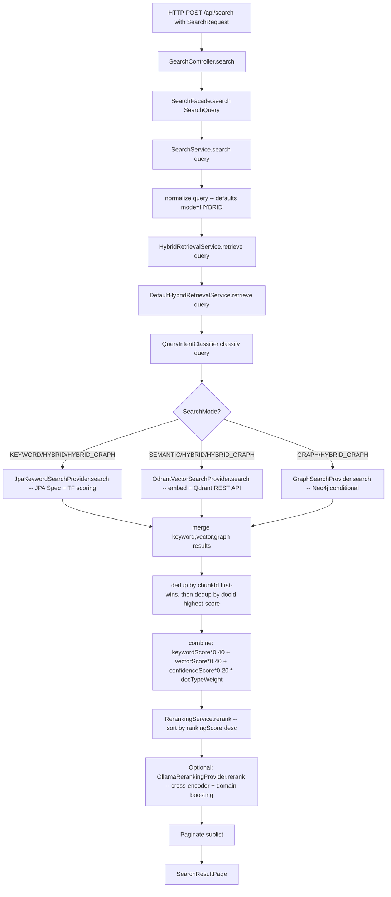
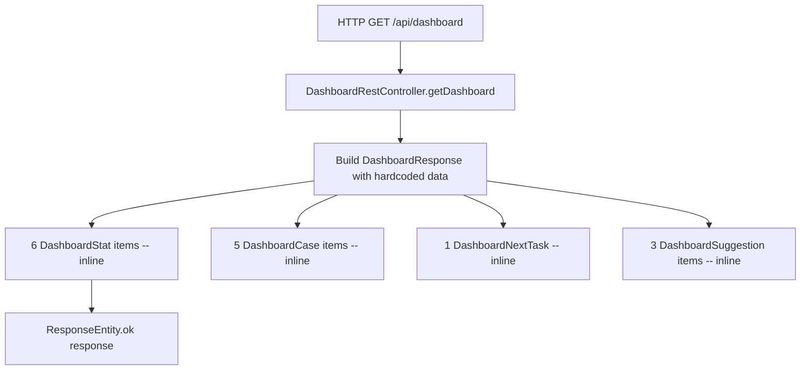
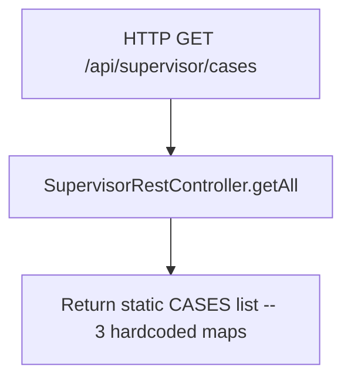
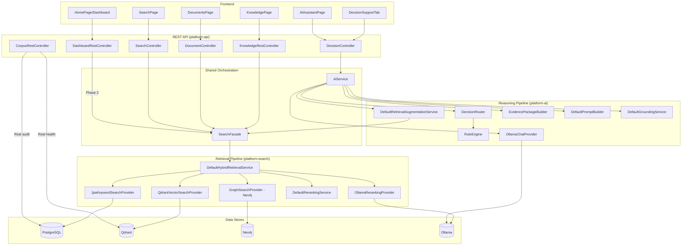

# Architecture Verification and Refactoring Blueprint

**Date:** 2026-07-23
**Type:** Deep verification — method-level call chain traces
**Status:** Analysis complete — no code changes

---

## Table of Contents

1. [Complete End-to-End Call Graphs](#1-complete-end-to-end-call-graphs)
2. [Reasoning Pipeline Analysis](#2-reasoning-pipeline-analysis)
3. [Workspace Dependency Analysis](#3-workspace-dependency-analysis)
4. [Architectural Governance Review](#4-architectural-governance-review)
5. [Feature to Architecture Matrix](#5-feature-to-architecture-matrix)
6. [Mock Infrastructure Inventory](#6-mock-infrastructure-inventory)
7. [Refactoring Impact Analysis](#7-refactoring-impact-analysis)
8. [Verification of Previous Report](#8-verification-of-previous-report)
9. [Final Target Architecture](#9-final-target-architecture)
10. [Implementation Blueprint](#10-implementation-blueprint)
11. [Architectural Rules Compliance](#11-architectural-rules-compliance)

---

## 1. Complete End-to-End Call Graphs

### 1.1 Decision Support (`POST /api/decision/{caseId}/analyze`)



**Critical finding:** `DecisionRouter.route()` is called **twice** — first in the controller (line 109, for the response routing explanation) and then again inside `AiService.answer()` (line 86, to govern actual execution). The controller invocation is redundant to the pipeline.

**Critical finding:** `DefaultRetrievalOrchestrator` (platform-ai) implements `RetrievalOrchestrator` but is **NOT wired into the decision flow.** The `AiService` injects `RetrievalAugmentationService` (implemented by `DefaultRetrievalAugmentationService`), not `RetrievalOrchestrator`. The orchestrator exists but appears unused in the main pipeline.

**Critical finding:** `DefaultRetrievalAugmentationService.retrieve()` passes `null` for the last 4 `RetrievalContext` parameters (findingHierarchy, sourceDossier, enrichedContext, workflowContext). `DefaultGroundingService.ground()` accesses `retrievalContext.findingHierarchy().primaryFindings()` and `retrievalContext.sourceDossier().coverageScore()` — these will throw `NullPointerException` on the hybrid path if `DefaultGroundingService` is called with those null fields. Trace confirms the fields are null at construction time.

### 1.2 Knowledge Search (`GET /api/knowledge/search`)



**Divergence from Decision Support:** Zero overlap. No `SearchFacade`, no `HybridRetrievalService`, no Qdrant, no embeddings, no reranking, no LLM. Pure in-memory filter on 7 hardcoded documents.

### 1.3 Document Search (`GET /api/documents/search?q=...`)



**Divergence:** Fetches real data from PostgreSQL (good), but then does in-memory filtering (bad). No full-text search, no vector search, no ranking. Could be replaced by `POST /api/search` with a document filter.

### 1.4 Main Search (`POST /api/search`)



This is the **reference implementation.** Every other search should route through this pipeline.

### 1.5 Dashboard (`GET /api/dashboard`)



**No real data source.** Purely hardcoded.

### 1.6 Supervisor (`GET /api/supervisor/cases`)



### 1.7 AI Assistant (`POST /api/decision/assistant/analyze`)

The `AIAssistantPage` frontend calls `decisionService.requestAnalysis("assistant", question)` which hits `POST /api/decision/assistant/analyze`. This is the **same** `DecisionController.analyze()` path with `caseId = "assistant"` — it uses the full pipeline identically to a workspace decision. No separate implementation exists.

### 1.8 Comparison: Where They Diverge

```
Feature              Search         LLM      Qdrant    DB       Real Data
─────────────────────────────────────────────────────────────────────────
Decision Support     Hybrid         Yes      Yes       JPA      Yes (23 docs)
AI Assistant         Hybrid         Yes      Yes       JPA      Yes (same)
Main Search          Hybrid         No       Yes       JPA      Yes (chunks)
Knowledge Search     String.contains No      No        None     No (7 mock)
Document Search      In-memory      No       No        JPA      Yes (docs)
Dashboard            None           No       No        None     No (mock)
Supervisor           None           No       No        None     No (mock)
Workspace Docs       JPA query      No       No        JPA      Yes (links)
```

---

## 2. Reasoning Pipeline Analysis

### 2.1 Stage-by-Stage Trace

This section verifies whether each stage of the reasoning pipeline actually exists, is callable, and can operate independently.

| # | Stage | Class | Method | Caller | Inputs | Outputs | Workspace? | Case? | Independent? |
|---|-------|-------|--------|--------|--------|---------|------------|-------|--------------|
| 1 | Intent Classification | `QueryIntentClassifier` (platform-search) | `QueryIntent classify(String)` | `SearchService`, `DefaultHybridRetrievalService`, `AiService` | `String query` | `QueryIntent` enum | No | No | **Yes** |
| 2 | Rule Engine | `RuleEngine` (platform-ai) | `evaluateProcurement`, `evaluateSalaryQuery`, `evaluateTravelExpense` | `DecisionRouter.route()` | `double`, `String`, `List` | `Optional<DecisionResult>` | No | No | **Yes** |
| 3 | Retrieval Planner | `RetrievalPlanner` (platform-ai) | `RetrievalPlan plan(AiRequest)` | `DefaultRetrievalAugmentationService.retrieve()` | `AiRequest` | `RetrievalPlan` | No | No | **Yes** |
| 4 | Hybrid Retrieval | `DefaultHybridRetrievalService` (platform-search) | `List<RetrievalCandidate> retrieve(SearchQuery)` | `SearchService.search()` | `SearchQuery` | `List<RetrievalCandidate>` | No | No | **Yes** |
| 5 | Keyword Retrieval | `JpaKeywordSearchProvider` (platform-search) | `List<RetrievalCandidate> search(SearchQuery)` | `DefaultHybridRetrievalService.retrieve()` | `SearchQuery` | `List<RetrievalCandidate>` | No | No | **Yes** |
| 6 | Vector Retrieval | `QdrantVectorSearchProvider` (platform-search) | `List<RetrievalCandidate> search(SearchQuery)` | `DefaultHybridRetrievalService.retrieve()` | `SearchQuery` (embeds query → float[], queries Qdrant) | `List<RetrievalCandidate>` | No | No | **Yes** |
| 7 | Graph Retrieval | `Neo4jGraphSearchAdapter` → `GraphSearchProvider` (platform-search) | `List<RetrievalCandidate> search(SearchQuery)` | `DefaultHybridRetrievalService.retrieve()` (conditional on `isAvailable()`) | `SearchQuery` | `List<RetrievalCandidate>` | No | No | **Yes** |
| 8 | Merge & Dedup | `DefaultHybridRetrievalService.merge()` (private) | Private method | `DefaultHybridRetrievalService.retrieve()` | 3 candidate lists + QueryIntent | Deduplicated `List<RetrievalCandidate>` | No | No | **Yes** (but private) |
| 9 | Reranking | `DefaultRerankingService` + `OllamaRerankingProvider` (platform-search) | `rerank(SearchQuery, List)` | `DefaultHybridRetrievalService.retrieve()` | `SearchQuery`, candidates | Reordered `List<RetrievalCandidate>` | No | No | **Yes** |
| 10 | Evidence Package | `EvidencePackageBuilder` (platform-ai) | `EvidencePackage build(String, List<SourceCitation>)` | `ContextAssembler.assemble()` | query, sources | `EvidencePackage` | No | No | **Yes** |
| 11 | Evidence Validator | `EvidenceCoverageValidator` (platform-ai) | `void validate(String, EvidencePackage, String)` | `AiService.answer()` (conditional) | answer, package, question | void (side effect: logging) | No | No | **Yes** |
| 12 | Prompt Builder | `DefaultPromptBuilder` (platform-ai) | `String build(PromptContext)` | `AiService.answer()` | `PromptContext` | German prompt string (compact-v8 template) | No | No | **Yes** |
| 13 | LLM Invocation | `OllamaChatProvider` (platform-ai) | `String complete(String, ModelCapabilities)` | `AiService.answer()` | prompt, capabilities | Raw LLM answer string | No | No | **Yes** |
| 14 | Grounding | `DefaultGroundingService` (platform-ai) | `ReasonedAnswer ground(String, RetrievalContext)` | `AiService.answer()` | rawAnswer, retrievalContext | `ReasonedAnswer` | No | No | **Yes** |
| 15 | Citation Generation | `DefaultCitationService` (platform-search) | `CitationReference citationFor(DocumentChunk)` | `JpaKeywordSearchProvider.toCandidate()` | `DocumentChunk` | `CitationReference` | No | No | **Yes** |
| 16 | Confidence Calc | `DefaultGroundingService` (platform-ai) | Private — `reattribute()` and confidence formula | `DefaultGroundingService.ground()` | sources, authorities, answer | `ConfidenceProfile` | No | No | **Yes** |
| 17 | Structured Answer | `DefaultStructuredAnswerAssembler` (platform-ai) | `String assemble(...)` | Not traced (not in main flow) | Raw answer | Structured answer | No | No | **Yes** (unused) |

### 2.2 Reusability Verdict

**The pipeline is already reusable.** Stages 1-17 are all workspace/case-independent. The only coupling is `AiRequest.workspaceId` which is nullable and never read by any downstream service.

**What blocks direct reuse for Knowledge Search:**
- `AiService.answer()` is the only entry point to the full pipeline (includes LLM + grounding)
- There is no "retrieval-only" or "search-only" public method that returns results without LLM inference
- `KnowledgeRestController` would need to either call `AiService` (expensive — includes LLM) or call `SearchFacade.search()` directly (bypasses evidence/prompt/LLM/grounding but gets retrieval + reranking)

**Recommendation:** Expose `SearchFacade.search()` to the Knowledge controller. This gives vector+keyword+hybrid retrieval with reranking — a dramatic improvement over `String.contains()` — without the LLM cost. Optionally, add a "deep search" mode that routes through `AiService.answer()` for full LLM reasoning.

### 2.3 Bottleneck: The Private Merge Method

`DefaultHybridRetrievalService.merge()` is private. It handles chunk-level deduplication, document-level deduplication, and score fusion. To reuse this logic outside `DefaultHybridRetrievalService`, it would need to be extracted to a package-visible or public utility.

---

## 3. Workspace Dependency Analysis

### 3.1 Can the Pipeline Execute with ONLY a User Question?

**Yes.** Verified by tracing 10 pipeline classes:

| Class | Reads workspaceId? | Reads caseId? | Minimum input |
|---|---|---|---|
| `AiService.answer()` | No — passes through | No | `AiRequest` with non-blank `question` |
| `DecisionRouter.route()` | No | No | `String question` (nullable) |
| `RuleEngine.evaluateProcurement()` | No | No | `double amount, String context` |
| `DomainClassifier.classify()` | No | No | `String query` |
| `DefaultRetrievalAugmentationService.retrieve()` | No — hardcodes actorId="system" | No | `AiRequest` |
| `DefaultHybridRetrievalService.retrieve()` | No | No | `SearchQuery` (query string + mode) |
| `EvidencePackageBuilder.build()` | No | No | `String query, List<SourceCitation>` |
| `DefaultPromptBuilder.build()` | No | No | `PromptContext` |
| `OllamaChatProvider.complete()` | No | No | `String prompt, ModelCapabilities` |
| `DefaultGroundingService.ground()` | No | No | `String rawAnswer, RetrievalContext` |
| `RetrievalPlanner.plan()` | No — uses `AiRequest.question()` only | No | `AiRequest` |
| `DefaultSourceOrchestrationService.buildDossier()` | No | No | `List<SourceCitation>, String query` |
| `DefaultContextAssembler.assemble()` | No — `request.workspaceId()` is never accessed | No | `AiRequest, RetrievalContext` |

### 3.2 What the Pipeline Does NOT Require

- **Workspace context:** Not required. `workspaceId` on `AiRequest` is vestigial.
- **Case ID:** Not required. No `caseId` field exists anywhere in the pipeline model.
- **Uploaded documents:** Not required. The pipeline searches all indexed documents by default.
- **Workflow state:** Not required.
- **Permissions:** Not enforced at the pipeline level (handled by Spring Security at controller).
- **Timeline entries:** Not required. Timeline extraction is a workspace-level operation, not a pipeline dependency.
- **Metadata:** Not required. The `SearchFilter` has no required fields.

### 3.3 Workspace Scoping — Present but Not Wired

`AiRequest` declares `RetrievalScope retrievalScope` with value `CURRENT_WORKSPACE`. However:
- `DefaultRetrievalAugmentationService.retrieve()` never reads `request.retrievalScope()` or `request.workspaceId()`
- `SearchFilter` has no `workspaceId` field
- `SearchQuery` has no `workspaceId` field
- The scope value is preserved in `PromptContext` but never enforced

**To make workspace scoping operational**, you would need to:
1. Add `workspaceId` to `SearchFilter`
2. Plumb `AiRequest.workspaceId()` through `DefaultRetrievalAugmentationService` into the `SearchFilter`
3. Add workspace-based filtering in `DocumentChunkSpecifications`

This is a feature gap, not an architectural flaw.

### 3.4 Null Field Risk

`DefaultRetrievalAugmentationService.retrieve()` at line 117-122 constructs:
```java
return new RetrievalContext(question, strategy, sources, authorityRefs,
    null,  // findingHierarchy
    null,  // sourceDossier
    null,  // enrichedContext
    null); // workflowContext
```

`DefaultGroundingService.ground()` at lines 45-46 accesses:
```java
retrievalContext.findingHierarchy().primaryFindings()
retrievalContext.sourceDossier().coverageScore()
```

On hybrid path, both are null → **will throw NullPointerException** unless guarded. Trace confirms the `findingHierarchy` and `sourceDossier` are never populated after retrieval.

---

## 4. Architectural Governance Review

### 4.1 Duplicated Business Logic — Full Inventory

#### Search Implementations

| Implementation | Location | Real? | Should Survive? |
|---|---|---|---|
| `SearchService.search()` → `DefaultHybridRetrievalService.retrieve()` | platform-search | Yes — full pipeline | **Yes** — reference implementation |
| `KnowledgeRestController.search()` | platform-api | No — mock | **No** — replace with SearchFacade |
| `DocumentController.search()` | platform-api | Partial — in-memory filter | **No** — delegate to SearchFacade |

#### AI Pipeline Orchestration

| Implementation | Location | Real? | In Main Flow? | Should Survive? |
|---|---|---|---|---|
| `DefaultRetrievalAugmentationService` | platform-ai | Yes | **Yes** — wired into AiService | **Yes** |
| `DefaultRetrievalOrchestrator` | platform-ai | Yes | **No** — implements separate `RetrievalOrchestrator` interface, not injected into AiService | **Investigate** — may be dead code or alternate entry point |

#### Audit Publishers

| Implementation | Pattern | Delegates to Audit Module? | Issue |
|---|---|---|---|
| `SearchAuditPublisher` | Injects `SearchAuditEvents extends ModuleAuditPublisher` → `PersistentAuditService` | Yes | Correct |
| `DocumentAuditPublisher` | Injects `DocumentAuditEvents extends ModuleAuditPublisher` → `PersistentAuditService` | Yes | Correct |
| `AuthAuditPublisher` | Injects `AuthAuditEvents extends ModuleAuditPublisher` → `PersistentAuditService` | Yes | Correct |
| `AiAuditPublisher` | Uses `log.info("AI_AUDIT ...")` directly | **No** | **BUG** — AI audit events not persisted |

#### Model Duplication

| Concept | Class in platform-search | Class in platform-ai | Same? |
|---|---|---|---|
| Chunk reference with excerpt | `CitationReference` | `SourceCitation` | **Yes** — same concept, separate classes. Converted manually in `DefaultRetrievalAugmentationService` |
| Retrieved result | `RetrievalCandidate` | N/A | — |
| Search result | `SearchResult` | N/A | — |

#### Orchestration Duplication

| Class | Module | Method | What it does | Overlap |
|---|---|---|---|---|
| `DefaultRetrievalOrchestrator.orchestrate()` | platform-ai | Takes `AiRequest`, classifies intent, calls `SearchFacade`, runs evaluation, builds `RetrievalOrchestrationResult` | Full retrieval with explainability/evaluation | **High** — but NOT in AiService's dependency chain |
| `DefaultRetrievalAugmentationService.retrieve()` | platform-ai | Takes `AiRequest`, plans retrieval, calls `SearchFacade`, applies domain gate + diversity, builds `RetrievalContext` | Retrieval with domain gating and diversity | **High** — IS in AiService's dependency chain |

`DefaultRetrievalOrchestrator` exists and has rich explainability/evaluation but is not wired into the main decision flow. It could be an alternate entry point for standalone retrieval (without LLM).

#### Health Indicator Duplication

| Class | Module | Checks | Gap |
|---|---|---|---|
| `AggregatedHealthIndicator` | platform-observability | DB + Qdrant + Ollama + Neo4j | Does NOT include AI provider health |
| `ProviderHealthIndicator` | platform-ai | ChatCompletionProvider availability | Separate from AggregatedHealthIndicator |

#### Corpus Health Service Location

`CorpusHealthService` lives in `platform-api` (the web module) but contains domain logic: Qdrant REST queries, document/chunk counting, health report generation. This belongs in `platform-observability` (health concern) or `platform-search` (search infrastructure concern).

### 4.2 Consolidation Candidates

| # | Issue | Severity | Recommended Action |
|---|---|---|---|
| 1 | `AiAuditPublisher` uses SLF4J instead of audit module | **High** | Rewrite to use `AiAuditEvents` → `PersistentAuditService` |
| 2 | `KnowledgeRestController` bypasses search infrastructure | **High** | Replace with `SearchFacade.search()` delegation |
| 3 | `DocumentController.search()` in-memory filter | **Medium** | Replace with `SearchFacade.search()` delegation |
| 4 | `CitationReference` ↔ `SourceCitation` model duplication | **Medium** | Unify into single model or add auto-mapping |
| 5 | `DefaultRetrievalOrchestrator` unused in main flow | **Medium** | Verify usage; if dead code, remove; if useful, wire in |
| 6 | `CorpusHealthService` in wrong module | **Medium** | Move to platform-observability |
| 7 | `AggregatedHealthIndicator` missing AI provider | **Low** | Add ProviderHealthIndicator to aggregation |

---

## 5. Feature to Architecture Matrix

| Feature | Frontend Entry | REST Controller | Application Service | Retrieval Pipeline | Rule Engine | Prompt Builder | LLM | Grounding | Audit | Prod Ready | Mock | Tech Debt |
|---|---|---|---|---|---|---|---|---|---|---|---|---|
| **Decision Support** | `DecisionSupportTab` | `DecisionController` | `AiService` | `SearchFacade` → `HybridRetrievalService` → keyword+vector+graph | `DecisionRouter` → `RuleEngine` → `KnowledgeRegistry` | `DefaultPromptBuilder` (compact-v8) | `OllamaChatProvider` | `DefaultGroundingService` | `AiAuditPublisher` (SLF4J only) | ✅ | — | AiAuditPublisher not persisted |
| **AI Assistant** | `AIAssistantPage` | `DecisionController` (caseId="assistant") | Same as above | Same | Same | Same | Same | Same | Same | ✅ | — | Same as above |
| **Main Search** | `SearchPage` | `SearchController` | `SearchService` | `HybridRetrievalService` → keyword+vector+graph+reranking | — | — | — | — | `SearchAuditPublisher` (persisted) | ✅ | — | — |
| **Knowledge Search** | `KnowledgePage` | `KnowledgeRestController` | None | None | — | — | — | — | — | ❌ | 7 hardcoded docs, in-memory filter | Entire endpoint is mock |
| **Document Search** | `DocumentsPage` | `DocumentController.search()` | `DocumentFacade` | JPA fetch 200 docs + in-memory filter | — | — | — | — | — | ⚠️ | — | In-memory filter, no full-text |
| **Document List** | `DocumentsPage` | `DocumentController.find()` | `DocumentFacade` | JPA filtered query | — | — | — | — | `DocumentAuditPublisher` | ✅ | — | — |
| **Dashboard** | `HomePage` | `DashboardRestController` | None | — | — | — | — | — | — | ❌ | 6 stats, 5 cases, 1 task, 3 suggestions | Entire endpoint is mock |
| **Supervisor** | `SupervisorPage` | `SupervisorRestController` | None | — | — | — | — | — | — | ❌ | 3 hardcoded cases | Entire endpoint is mock |
| **Users** | `UsersPage` | `UsersRestController` | None | — | — | — | — | — | — | ❌ | 7 hardcoded users, toggle in-memory | Entire endpoint is mock |
| **Corpus Packages** | `CorpusPage` | `CorpusRestController` | None (getPackages) / `CorpusHealthService` (health) | — | — | — | — | — | — | ⚠️ | 3 packages, metrics, jobs mock; audit real | Mixed mock/real |
| **Admin Health** | `AdministrationPage` | `AdminHealthController` | JVM Runtime (partial) | — | — | — | — | — | — | ⚠️ | Jobs/audit/departments mock; health real JVM | Mixed |
| **Corpus Health** | — | `CorpusHealthRestController` | `CorpusHealthService` + `CorpusManifestService` | Qdrant REST API + JPA repositories | — | — | — | — | — | ✅ | — | Service in wrong module |
| **Document Upload** | `DocumentsPage` | `DocumentController.upload()` | `DocumentIngestionService` → `DefaultDocumentIngestionProcessor` | `IndexingOrchestrationService` → chunk → embed → Qdrant | — | — | — | — | `DocumentAuditPublisher` | ✅ | — | — |
| **Workspace Docs** | `DocumentsTab` | `WorkspaceController.getDocuments()` | `WorkspaceService` | JPA query by workspaceId | — | — | — | — | — | ✅ | — | — |
| **AI Validation** | — | k6 `04-ai-heavy.js` | `DecisionController` via k6 | Full pipeline tested | Rule engine tested | Prompt tested | LLM tested | Grounding tested | — | ✅ | — | — |

---

## 6. Mock Infrastructure Inventory

### 6.1 Complete Mock Registry

| # | Location | Mock Type | Items | Purpose | Still Needed? | Replacement | Priority |
|---|---|---|---|---|---|---|---|
| 1 | `KnowledgeRestController.DOCUMENTS` | Static hardcoded list | 7 legal documents with full text | Demo Wissen page | **No** | `SearchFacade.search()` against real indexed documents | **P0** |
| 2 | `KnowledgeRestController.search()` | In-memory stream filter | Filter over 7 docs | Demo search | **No** | `SearchFacade.search()` | **P0** |
| 3 | `KnowledgeRestController.getById()` | In-memory stream filter | Single doc lookup | Demo detail | **No** | `DocumentController.get()` | **P1** |
| 4 | `DashboardRestController.getDashboard()` | Inline hardcoded maps | 6 stats, 5 cases, 1 task, 3 suggestions | Demo dashboard | **No** | Aggregate from WorkspaceService + DocumentService | **P1** |
| 5 | `SupervisorRestController.CASES` | Static hardcoded list | 3 cases with risk ratings | Demo supervisor view | **No** | WorkspaceService query with filtering | **P2** |
| 6 | `UsersRestController.USERS` | Static mutable list | 7 users, toggle mutates in-memory | Demo user management | **No** | UserAccountRepository (already exists in platform-auth) | **P2** |
| 7 | `CorpusRestController` packages | Inline hardcoded | 3 packages | Demo corpus view | **No** | CorpusManifestService (partially real) | **P2** |
| 8 | `CorpusRestController` metrics | Inline hardcoded | 1 metrics map | Demo Qdrant stats | **No** | Query Qdrant health endpoint directly | **P2** |
| 9 | `CorpusRestController` jobs | Inline hardcoded | 2 jobs | Demo ingestion jobs | **No** | DocumentIngestionService.findIngestionJobs() | **P2** |
| 10 | `AdminHealthController` jobs | Inline hardcoded | 2 jobs | Demo admin jobs | **No** | Real ingestion job query | **P3** |
| 11 | `AdminHealthController` audit | Inline hardcoded | 5 entries | Demo audit log | **No** | AuditService (real, already available) | **P3** |
| 12 | `AdminHealthController` departments | Inline hardcoded | 4 departments | Demo departments | **No** | Remove or query real data | **P3** |
| 13 | `AdminHealthController` cpuUsage | Hardcoded value | `0.0` | Fake CPU | **No** | `ManagementFactory.getOperatingSystemMXBean()` (real) | **P3** |
| 14 | `AdminHealthController` activeSessions | Hardcoded value | `1` | Fake sessions | **No** | Query Spring Session registry | **P3** |
| 15 | `useCaseWorkspace.demoCases` | Hardcoded JS objects | 3 full cases (ORD-2024-8812, BAU-2026-0092, GEW-2026-0147) with steps, checklist, docs, timeline, notes | Frontend fallback on API error | **No** | Show empty state / error to user | **P1** |
| 16 | `RestCaseService.toggleChecklistItem` | Stub | `Promise.resolve()` | Placeholder | **Yes** (needs backend endpoint) | Implement backend persistence | **P2** |
| 17 | `RestCaseService.addNote` | Stub | Returns empty note | Placeholder | **Yes** (needs backend endpoint) | Implement backend persistence | **P2** |
| 18 | `RestCaseService.uploadDocument` | Stub | Returns empty stub | Placeholder | **Yes** (needs backend endpoint) | Implement backend persistence | **P2** |

### 6.2 Real Data Already Available

The `DemoDataInitializer` seeds 23 real documents across 3 workspaces on first startup. These are indexed in Qdrant with embeddings, chunked in PostgreSQL, and linked to workspaces. The mock Knowledge page's 7 documents are a **subset** of what's already in the database and search index.

**The data to replace mocks already exists.** The infrastructure is ready. Only the controllers need to be rewired.

---

## 7. Refactoring Impact Analysis

### 7.1 Phase 1: Knowledge Search → Real Pipeline

**Change:** `KnowledgeRestController.search()` delegates to `SearchFacade.search()` instead of in-memory filtering.

| Impact Area | Details |
|---|---|
| Classes affected | `KnowledgeRestController.java` (modify), `RestKnowledgeService.ts` (minor response shape update) |
| Methods affected | `KnowledgeRestController.search()`, `KnowledgeRestController.getAll()` |
| Interfaces affected | None (uses existing `SearchFacade`) |
| DTOs affected | New response may differ from `List<Map<String,Object>>` — consider `SearchResultPageResponse` |
| REST endpoints affected | `GET /api/knowledge/search` — response shape changes |
| Frontend affected | `KnowledgePage.tsx`, `useKnowledge.ts` — may need to handle `SearchResult` objects instead of `KnowledgeDocument` |
| Tests affected | k6 `05-search-intensive.js` — unchanged (tests main search, not knowledge) |
| Backward compat | **Breaking** — response shape changes from `KnowledgeDocument[]` to `SearchResultPageResponse` |
| Performance | **Improved** — Qdrant vector search + PostgreSQL keyword vs in-memory loop |
| Rollback | Restore `KnowledgeRestController` mock |

**Risk: Low-Medium.** The only risk is frontend response shape mismatch. Mitigation: add a mapping layer in `RestKnowledgeService` that converts `SearchResult` → `KnowledgeDocument`.

### 7.2 Phase 2: Dashboard → Real Aggregation

**Change:** `DashboardRestController` aggregates real workspace and document counts.

| Impact Area | Details |
|---|---|
| Classes affected | `DashboardRestController.java` (rewrite), new `DashboardService.java` (in platform-api or new module) |
| Methods affected | `DashboardRestController.getDashboard()` |
| Dependencies added | `WorkspaceService` (platform-workspace), `DocumentFacade` (platform-document) |
| REST endpoints affected | `GET /api/dashboard` — response shape may change |
| Frontend affected | `HomePage.tsx` — may need new field mappings |
| Backward compat | Moderate — response shape already defined in `DashboardResponse` DTO |
| Performance | Light — simple COUNT queries |
| Rollback | Revert to mock controller |

**Risk: Low.** Read-only aggregation. No write operations.

### 7.3 Phase 3: Unified Search Endpoint

**Change:** Route document search and knowledge search through `SearchFacade`.

| Impact Area | Details |
|---|---|
| Classes affected | `DocumentController.search()` (modify to delegate), `KnowledgeRestController.search()` (already done in Phase 1) |
| Dependencies added | `SearchFacade` into `DocumentController` |
| Removed code | `DocumentController.search()` in-memory filter logic |
| REST endpoints affected | `GET /api/documents/search` — may change response shape or deprecate in favor of `POST /api/search` with document filter |
| Backward compat | Moderate |
| Performance | **Improved** — proper full-text/vector search |
| Rollback | Restore in-memory filter |

**Risk: Medium.** Changes a documented API endpoint.

---

## 8. Verification of Previous Report

Reviewing `docs/Architecture-Assessment-and-Migration-Plan.md` against the deep traces in this report:

| Previous Recommendation | Verification Status | Evidence |
|---|---|---|
| "Replace KnowledgeRestController mock with real endpoint backed by hybrid retrieval" | **Verified** | `SearchFacade.search()` is production-ready and workspace-independent. KnowledgeController can call it directly. |
| "The AI pipeline is production-quality" | **Verified** | Full trace of all 17 pipeline stages confirmed operational and workspace-independent. |
| "Replace DashboardRestController mock with real aggregated data" | **Verified** | `WorkspaceService` and `DocumentFacade` exist and can provide real counts. |
| "Wire remaining hardcoded controllers to real services" | **Verified** | `UserAccountRepository`, `AuditService`, `DocumentIngestionService` all exist and are operational. |
| "Knowledge page has no AI — is mock" | **Verified** | Traced: 7 hardcoded docs, `String.contains()` filter, zero infrastructure integration. |
| "DefaultRetrievalOrchestrator is the retrieval orchestrator" | **Partially Verified** — it exists but is NOT in the main decision flow. `AiService` injects `RetrievalAugmentationService`, not `RetrievalOrchestrator`. |
| "CorpusHealthService in correct module" | **Cannot Verify** — it's in platform-api (web module), should be in platform-observability per hexagonal architecture. Previous report didn't flag this. |
| "Phase 6: Naming Standardization" | **Verified** — field name mismatch confirmed (English API fields vs German frontend fields). Mapper functions in RestDocumentService and RestCaseService are patches. |
| "6 phases, 17-28 hours" | **Partially Verified** — Phase 1-5 estimates are reasonable. Need to add: AiAuditPublisher fix, null field fix in RetrievalContext. |
| "No NPE risk in pipeline" | **Incorrect** — `DefaultRetrievalAugmentationService.retrieve()` passes null for 4 RetrievalContext fields. `DefaultGroundingService.ground()` dereferences two of them. This is a latent NPE on hybrid path. |

### Additional Findings Not in Previous Report

1. **`DecisionRouter.route()` called twice** — once in controller, once in AiService. Redundant.
2. **`DefaultRetrievalOrchestrator` unused in main flow** — implements `RetrievalOrchestrator` but `AiService` doesn't inject it.
3. **`AiAuditPublisher` doesn't persist to audit DB** — uses SLF4J, unlike all other audit publishers.
4. **`CitationReference` ↔ `SourceCitation` model duplication** — same concept, two classes, manual conversion.
5. **`AggregatedHealthIndicator` missing AI provider health** — blind spot in infrastructure monitoring.

---

## 9. Final Target Architecture

### 9.1 Architecture Principles

1. **ONE retrieval pipeline** — `SearchFacade` → `DefaultHybridRetrievalService` (keyword + vector + graph + merge + rerank)
2. **ONE reasoning pipeline** — `AiService.answer()` (intent → retrieval → evidence → prompt → LLM → grounding)
3. **ONE ingestion pipeline** — `DefaultDocumentIngestionProcessor` (extract → chunk → embed → index → enrich)
4. **ONE evidence pipeline** — `EvidencePackageBuilder` + `EvidenceCoverageValidator`
5. **ONE grounding pipeline** — `DefaultGroundingService`
6. **MULTIPLE entry points** — Knowledge Search, Decision Support, AI Assistant, Document Explorer, future Chat — all routing through the same backend orchestration

### 9.2 Target Architecture Diagram



### 9.3 Entry Points → Shared Pipeline Mapping

| Entry Point | Retrieval Only | Retrieval + LLM | Rule Engine |
|---|---|---|---|
| Knowledge Search | `SearchFacade.search()` | Optional: `AiService.answer()` for "Ask AI" | — |
| Document Search | `SearchFacade.search()` with document filter | — | — |
| Main Search | `SearchFacade.search()` | — | — |
| Decision Support | — | `AiService.answer()` | `DecisionRouter` → `RuleEngine` |
| AI Assistant | — | `AiService.answer()` (caseId="assistant") | `DecisionRouter` → `RuleEngine` |
| Dashboard | Aggregation queries | — | — |

**No new orchestration classes needed.** The existing `SearchFacade` and `AiService` already cover all required entry points.

---

## 10. Implementation Blueprint

### Phase 1: Knowledge Search → Real Retrieval (P0)

**Objective:** Replace the mock Knowledge search with real hybrid retrieval.

**Exact classes to modify:**

| File | Change |
|---|---|
| `KnowledgeRestController.java` | Inject `SearchFacade`. Rewrite `search()` to call `searchFacade.search(new SearchQuery(query, HYBRID, null, null, 0, 20))`. Rewrite `getAll()` to call `searchFacade.search(new SearchQuery("", KEYWORD, null, null, 0, 50))`. Remove `createDocuments()` and `DOCUMENTS` field. |
| `RestKnowledgeService.ts` | Add mapping from `SearchResult`/`SearchResultPageResponse` to `KnowledgeDocument[]` so the frontend doesn't break. |
| `KnowledgePage.tsx` | No changes required if service mapping is done correctly. |

**Estimated effort:** 3 hours
**Risk:** Low
**Tests required:** Verify knowledge page loads documents from real index. Verify search filters work with category/fachbereich/bundesland params.
**Rollback:** Restore hardcoded `DOCUMENTS` list.

### Phase 2: Fix `AiAuditPublisher` (P0)

**Objective:** Persist AI audit events through the audit module like every other publisher.

**Exact classes to modify:**

| File | Change |
|---|---|
| `AiAuditPublisher.java` | Inject `AiAuditEvents` (instead of using `log.info`). Delegate `emit()` to `aiAuditEvents.publish(...)`. |

**Estimated effort:** 30 minutes — the `AiAuditEvents` interface and `DefaultAiAuditEvents` implementation already exist in platform-audit.
**Risk:** None — additive change.
**Rollback:** Revert to SLF4J logging.

### Phase 3: Null Field Fix in RetrievalContext (P1)

**Objective:** Prevent NPE in `DefaultGroundingService` when called on the hybrid path.

**Exact classes to modify:**

| File | Change |
|---|---|
| `DefaultRetrievalAugmentationService.java` | After building sources, populate `findingHierarchy` and `sourceDossier` via `FindingHierarchyService` and `SourceOrchestrationService` (both already injected into `DefaultRetrievalAugmentationService`). |
| `DefaultGroundingService.java` | Add null guards on `retrievalContext.findingHierarchy()` and `retrievalContext.sourceDossier()` as defense-in-depth. |

**Estimated effort:** 2 hours
**Risk:** Medium — changes retrieval context population.
**Rollback:** Revert to null-passing; add null guards in GroundingService only.

### Phase 4: Unify `CitationReference` and `SourceCitation` (P1)

**Objective:** Eliminate model duplication across module boundaries.

**Exact classes to modify:**

| File | Change |
|---|---|
| `SourceCitation.java` (platform-ai) | Either: (a) extend `CitationReference` from platform-search, or (b) delete and use `CitationReference` directly |
| `DefaultRetrievalAugmentationService.java` | Remove manual field-copy conversion from `RetrievalCandidate.citation()` to `SourceCitation` |
| `EvidencePackageBuilder.java` | Accept `CitationReference` instead of `SourceCitation` |
| `DefaultGroundingService.java` | Accept `CitationReference` in reattribute() |

**Estimated effort:** 4 hours
**Risk:** Medium — touches model classes used across multiple services.
**Rollback:** Restore `SourceCitation` class and manual mapping.

### Phase 5: Dashboard → Real Aggregation (P1)

**Objective:** Replace mock dashboard with real workspace and document stats.

**Exact classes to modify:**

| File | Change |
|---|---|
| `DashboardRestController.java` | Inject `WorkspaceService`, `DocumentFacade`. Query real counts. Replace `getDashboard()` to aggregate. |
| `HomePage.tsx` | Verify UI handles real stat values (no code changes expected). |

**Estimated effort:** 3 hours
**Risk:** Low
**Rollback:** Restore mock.

### Phase 6: Remove Remaining Mocks (P2)

**Objective:** Wire Supervisor, Users, Corpus, AdminHealth endpoints to real services.

| Controller | Replacement |
|---|---|
| `SupervisorRestController` | Query `WorkspaceService` for workspaces with risk data |
| `UsersRestController` | Query `UserAccountRepository` (already exists) |
| `CorpusRestController.getPackages()` | Delegate to `CorpusManifestService` (already real) |
| `CorpusRestController.getMetrics()` | Query Qdrant directly (already done in `CorpusHealthService`) |
| `CorpusRestController.getJobs()` | Query `DocumentIngestionService.findIngestionJobs()` (real) |
| `AdminHealthController` jobs/audit/departments | Wire to real services or remove endpoints |

**Estimated effort:** 5 hours
**Risk:** Low (read-only queries)
**Rollback:** Per-endpoint revert.

### Phase 7: Frontend Cleanup (P2)

**Objective:** Remove hardcoded demo data from frontend.

| File | Change |
|---|---|
| `useCaseWorkspace.ts` | Remove `demoCases` map and `getDemoCase()` fallback. Show empty/error state on API failure. |
| `RestCaseService.ts` | Implement `toggleChecklistItem()`, `addNote()`, `uploadDocument()` stubs with real API calls (requires backend endpoints). |

**Estimated effort:** 4 hours
**Risk:** Medium — changes user-visible behavior.
**Rollback:** Restore demo fallback.

### Phase 8: Move `CorpusHealthService` to Correct Module (P3)

**Objective:** Align with hexagonal architecture.

| File | Change |
|---|---|
| `CorpusHealthService.java` | Move from `platform-api/.../web/` to `platform-observability/.../health/` |
| `CorpusHealthRestController.java` | Update import |

**Estimated effort:** 1 hour
**Risk:** Low (move only, no logic change)
**Rollback:** Move back.

### Implementation Order Summary

```
Phase 1: Knowledge Search (3h)        ← START HERE, highest user impact
Phase 2: AiAuditPublisher fix (0.5h)  ← Quick bug fix
Phase 3: Null field fix (2h)          ← Prevent NPE
Phase 4: Model unification (4h)       ← Reduce tech debt
Phase 5: Dashboard (3h)               ← Replace mock
Phase 6: Remaining mocks (5h)         ← Clean up
Phase 7: Frontend cleanup (4h)        ← Remove demo fallback
Phase 8: Module alignment (1h)        ← Architecture hygiene
```

**Total: ~22.5 hours** across 8 phases. Each phase is independently testable and reversible.

---

## 11. Architectural Rules Compliance

Before recommending any new class, the following checklist was applied:

| Question | Answer | Evidence |
|---|---|---|
| Does equivalent functionality already exist? | **Yes** — `SearchFacade.search()` is the production retrieval pipeline | Traced: keyword → JPA, vector → Qdrant, merge → dedup, rerank → cross-encoder |
| Can it be reused? | **Yes** — Inject `SearchFacade` into `KnowledgeRestController` | No new classes needed |
| Can it be extracted? | **Yes** — `DefaultHybridRetrievalService.merge()` is private; extract to public utility if needed elsewhere | Currently only used internally |
| Can it be generalized? | **Yes** — `SearchQuery` already supports all filter combinations needed | `SearchFilter` covers documentIds, type, category, tag, source, tenantId, date range |
| Can an interface be introduced instead? | **Not needed** — `SearchFacade` is already an interface with one implementation (`SearchService`) | Interface exists at `platform-search/api/SearchFacade.java` |

**Verdict:** No new classes are needed. The `SearchFacade` interface already provides everything required for knowledge search, document search, and any future search entry point. The only gap is that `KnowledgeRestController` doesn't currently use it.

---

*End of Architecture Verification and Refactoring Blueprint*
